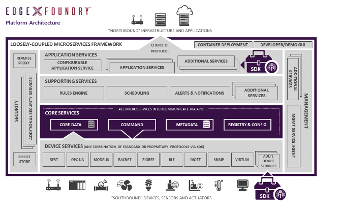
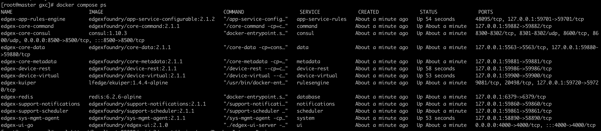
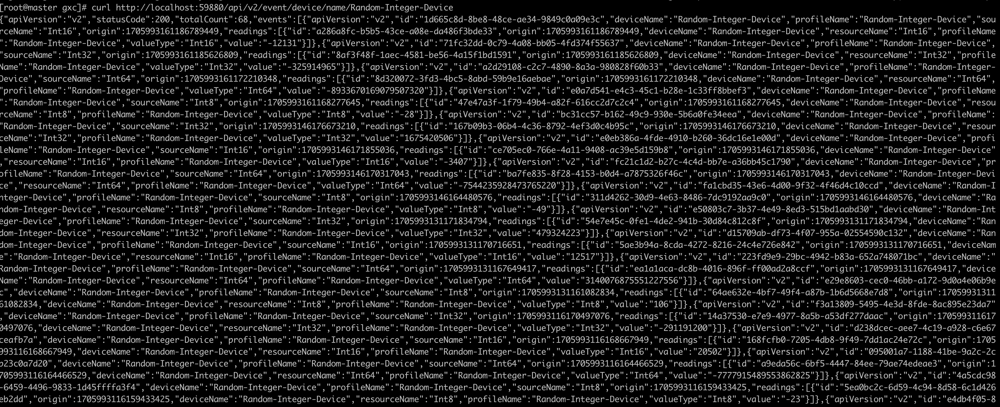
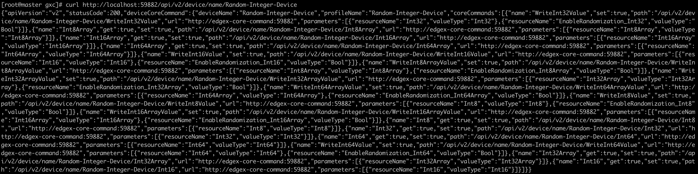
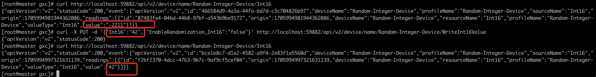

一个边缘中间件，在在物理传感和驱动“事物”与我们的信息技术 (IT) 系统之间提供服务
## 架构


### 应用服务层 Application Services
提取、处理/转换传感数据并将其从 EdgeX 发送到您选择的端点或进程的方法（MQTT，HTTP REST）
将生成的消息放入 MQTT 主题以发送到 Azure 或 AWS 是接收器完成应用程序服务的示例

### 支持服务层 Supporting Services（可选）
边缘分析使用，支持规则引擎，警报和通知等（Ekuiper）

### 核心服务层 Core Services

- 核心数据：持久存储库和相关管理服务，用于从存储传感器收集的数据。
- 命令：促进和控制从北侧到南侧（微服务和设备服务）的驱动请求的服务。
- 元数据：有关连接到 EdgeX Foundry 的对象的元数据存储库和关联管理服务。元数据提供了配置新设备并将其与其拥有的设备服务配对的能力。
- 注册表和配置：为其他 EdgeX Foundry 微服务提供有关 EdgeX Foundry 内关联服务和微服务配置属性（即初始化值存储库）的信息。

### 设备服务层 Device Services
连接一个或多个事物或设备（传感器、执行器等），提供服务

### 安全基础设施 **Security Infrastructure**
保护 EdgeX Foundry 管理的设备、传感器和其他物联网对象的数据和控制。
EdgeX 有两个主要安全组件。

- 安全存储，用于提供保存 EdgeX 机密的安全位置。EdgeX 机密的示例包括其他服务和连接到云系统的令牌所使用的数据库访问密码。
- API网关作为反向代理来限制对EdgeX REST资源的访问并执行访问控制相关的工作。

### **系统管理 System Management**
系统管理设施为外部管理系统提供了中心联系点，用于启动/停止/重新启动 EdgeX 服务、获取服务的状态/运行状况或获取 EdgeX 服务的指标（例如内存使用情况），以便 EdgeX 服务可以被监控。

## 原理

1、device service获取传感器数据，将其转为edgex事件对象，发送到消息总线（消息总线上事件消息的订阅者可以是应用程序服务或核心数据或两者）
2、core services获取事件，存在本地**边缘**数据库（redis）
3、核心数据通过 REST 从设备服务接收事件对象时，它会将传感器数据事件放在发往应用程序服务的消息主题上。默认情况下，Redis Pub/Sub 用作消息传递基础设施。MQTT 或 ZMQ 也可以用作核心数据和应用程序服务之间的消息传递基础设施。
4、应用程序服务根据需要转换数据并将数据推送到端点。端点可以是HTTP/S端点、MQTT主题、云系统（云主题）等。

边缘分析和驱动
5、应用程序服务可以处理 EdgeX 事件（及其包含的传感器数据），对收集的数据进行本地操作，EdgeX 附带一个简单的规则引擎（默认是eKuiper ）,
6、分析包可以探索传感器事件数据并做出触发设备驱动的决定。（调用核心命令服务来触发某些操作，例如在某些可控设备上“打开阀门”）
7、核心命令服务获取动作请求，并根据请求确定需要动作于哪个设备；然后调用所属设备服务来执行驱动

## 快速开始
### 启动服务
获取docker-compose文件
```
https://github.com/edgexfoundry/edgex-compose/blob/jakarta/docker-compose-no-secty.yml
```
```
docker-compose up -d
```


### 查询edgex-core-data(59880端口) 来查看device services是否上传数据
```
curl http://localhost:59880/api/v2/event/device/name/Random-Integer-Device
```

### 查看 edgex-core-command命令（59882端口）
当设备注册 EdgeX 服务时，它会提供Device Profile ，该配置文件描述该设备数据读取以及控制该设备的命令。
查看edgex-core-command，查看device有哪些命令支持控制设备
```
curl http://localhost:59882/api/v2/device/name/Random-Integer-Device
```

```
{
    "apiVersion": "v2",
    "statusCode": 200,
    "deviceCoreCommand": {
        "deviceName": "Random-Integer-Device",
        "profileName": "Random-Integer-Device",
        "coreCommands": [
            {
                "name": "WriteInt16Value",
                "set": true,
                "path": "/api/v2/device/name/Random-Integer-Device/WriteInt16Value",
                "url": "http://edgex-core-command:59882",
                "parameters": [
                    {
                        "resourceName": "Int16",
                        "valueType": "Int16"
                    },
                    {
                        "resourceName": "EnableRandomization_Int16",
                        "valueType": "Bool"
                    }
                ]
            },
            {
                "name": "Int16",
                "get": true,
                "set": true,
                "path": "/api/v2/device/name/Random-Integer-Device/Int16",
                "url": "http://edgex-core-command:59882",
                "parameters": [
                    {
                        "resourceName": "Int16",
                        "valueType": "Int16"
                    }
                ]
            }
            ...

        ]
    }
}
```
这里取两个命令作为示例
Int16（获取当前整数 16 值的命令）和WriteInt16Value（命令禁用随机整数 16 的生成并指定要返回的整数值）
向command端口发送Int16，get无需附加参数
```
curl http://localhost:59882/api/v2/device/name/Random-Integer-Device/Int16
```
向command端口发送WriteInt16Value
```
curl -X PUT -d '{"Int16":"42", "EnableRandomization_Int16":"false"}' http://localhost:59882/api/v2/device/name/Random-Integer-Device/WriteInt16Value
```

## 开发
作为绝对最小的集合，您通常需要运行核心元数据core-metadata、核心数据core-data、核心命令core-command和设备服务。
打开浏览器或 HTTP REST 客户端工具并使用服务的 ping 地址（如下所述）检查其是否可用。
```
http://localhost:[port]/api/v2/ping
```
默认端口[https://docs.edgexfoundry.org/2.1/general/ServicePorts/](https://docs.edgexfoundry.org/2.1/general/ServicePorts/)

