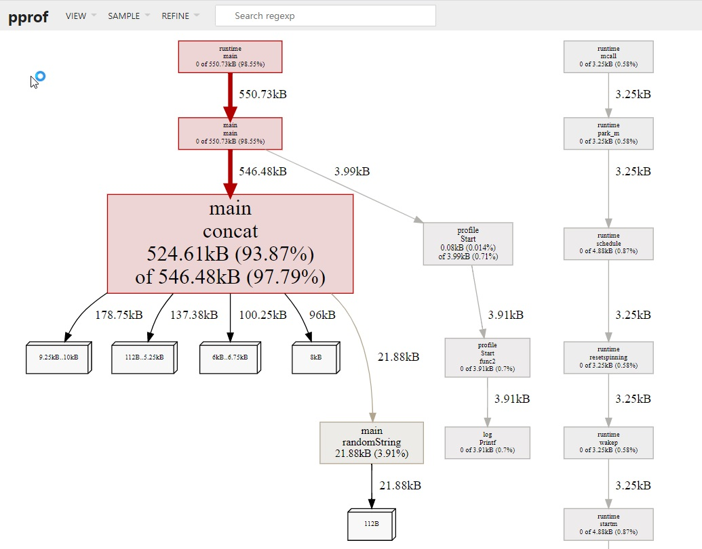

## benchmark基准测试
### 概念
Go 语言标准库内置的 testing 测试框架提供了基准测试(benchmark)的能力，benchmark和普通测试区别

| | **benchmark** | **普通单元测试** |
| --- | --- | --- |
| **位置** | 位于 _test.go 文件中 | 位于 _test.go 文件中 |
| **函数** | 以 Benchmark 开头 | 以 Test 开头 |
| **函数参数** |  b *testing.B | t *testing.T |
| **启动** | go test -bench . | go test example 或 go test . |

### 函数
使用 go mod init example 初始化一个模块，新增 fib.go 文件，实现函数 fib，用于计算第 N 个菲波那切数。
```
// fib.go
package main

func fib(n int) int {
	if n == 0 || n == 1 {
		return n
	}
	return fib(n-2) + fib(n-1)
}
```
### benchmark用例
接下来，我们在 fib_test.go 中实现一个 benchmark 用例：
```
// fib_test.go
package main

import "testing"

func BenchmarkFib(b *testing.B) {
	for n := 0; n < b.N; n++ {
		fib(30) // run fib(30) b.N times
	}
}
```
> benchmark 用例的参数 b *testing.B，有个属性 b.N 表示这个用例需要运行的次数。b.N 对于每个用例都是不一样的。
> 那这个值是如何决定的呢？b.N 从 1 开始，如果该用例能够在 1s 内完成，b.N 的值便会增加，再次执行。b.N 的值大概以 1, 2, 3, 5, 10, 20, 30, 50, 100 这样的序列递增，越到后面，增加得越快。


### 运行
```
guxc@guxuchengdeMBP benchmark % go test -bench .
goos: darwin
goarch: arm64
pkg: benchmark
BenchmarkFib-8               360           3314764 ns/op
PASS
ok      benchmark       1.534s
```
BenchmarkFib-8 中的 -8 即 GOMAXPROCS，默认等于 CPU 核数。可以通过 -cpu 参数改变 GOMAXPROCS
306 和 3314764 ns/op 表示用例执行了 306 次，每次花费约 0.003s。总耗时比 1s 略多。

### 正则运行
```
//-bench 参数支持传入一个正则表达式，
//匹配到的用例才会得到执行，
//例如，只运行以 Fib 结尾的 benchmark 用例

$ go test -bench='Fib$' .
goos: darwin
goarch: amd64
pkg: example
BenchmarkFib-8               202           5980669 ns/op
PASS
ok      example 1.813s
```

### 设置cpu运行
```
//可以通过 -cpu 参数改变 GOMAXPROCS
//-cpu 支持传入一个列表作为参数
$ go test -bench='Fib$' -cpu=2,4 .
goos: darwin
goarch: amd64
pkg: example
BenchmarkFib-2               206           5774888 ns/op
BenchmarkFib-4               205           5799426 ns/op
PASS
ok      example 3.563s
```

### 指定次数/时间
我们可以使用 -benchtime 和 -count 两个参数达到这个目的。
benchmark 的默认时间是 1s，那么我们可以使用 -benchtime 指定为 5s。例如：
```
$ go test -bench='Fib$' -benchtime=5s .
goos: darwin
goarch: amd64
pkg: example
BenchmarkFib-8              1033           5769818 ns/op
PASS
ok      example 6.554s
```
-benchtime 的值除了是时间外，还可以是具体的次数。例如，执行 30 次可以用 -benchtime=30x：
```
$ go test -bench='Fib$' -benchtime=50x .
goos: darwin
goarch: amd64
pkg: example
BenchmarkFib-8                50           6121066 ns/op
PASS
ok      example 0.319s
```
-count 参数可以用来设置 benchmark 的轮数。例如，进行 3 轮 benchmark。
```
$ go test -bench='Fib$' -benchtime=5s -count=3 .
goos: darwin
goarch: amd64
pkg: example
BenchmarkFib-8               975           5946624 ns/op
BenchmarkFib-8              1023           5820582 ns/op
BenchmarkFib-8               961           6096816 ns/op
PASS
ok      example 19.463s
```

### 内存分配次数
-benchmem 参数可以度量内存分配的次数。内存分配次数也性能也是息息相关的，例如不合理的切片容量，将导致内存重新分配，带来不必要的开销。
在下面的例子中，generateWithCap 和 generate 的作用是一致的，生成一组长度为 n 的随机序列。唯一的不同在于，generateWithCap 创建切片时，将切片的容量(capacity)设置为 n，这样切片就会一次性申请 n 个整数所需的内存。
```
// generate_test.go
package main

import (
	"math/rand"
	"testing"
	"time"
)

func generateWithCap(n int) []int {
	rand.Seed(time.Now().UnixNano())
	nums := make([]int, 0, n)
	for i := 0; i < n; i++ {
		nums = append(nums, rand.Int())
	}
	return nums
}

func generate(n int) []int {
	rand.Seed(time.Now().UnixNano())
	nums := make([]int, 0)
	for i := 0; i < n; i++ {
		nums = append(nums, rand.Int())
	}
	return nums
}

func BenchmarkGenerateWithCap(b *testing.B) {
	for n := 0; n < b.N; n++ {
		generateWithCap(1000000)
	}
}

func BenchmarkGenerate(b *testing.B) {
	for n := 0; n < b.N; n++ {
		generate(1000000)
	}
}
```
结果
```
go test -bench='Generate' .
goos: darwin
goarch: amd64
pkg: example
BenchmarkGenerateWithCap-8            44          24294582 ns/op
BenchmarkGenerate-8                   34          30342763 ns/op
PASS
ok      example 2.171s
```
可以看到生成 100w 个数字的随机序列，GenerateWithCap 的耗时比 Generate 少 20%。
我们可以使用 -benchmem 参数看到内存分配的情况：
```
goos: darwin
goarch: amd64
pkg: example
BenchmarkGenerateWithCap-8  43  24335658 ns/op  8003641 B/op    1 allocs/op
BenchmarkGenerate-8         33  30403687 ns/op  45188395 B/op  40 allocs/op
PASS
ok      example 2.121s
```
Generate 分配的内存是 GenerateWithCap 的 6 倍，设置了切片容量，内存只分配一次，而不设置切片容量，内存分配了 40 次。
### 测试不同的输入
测试不同复杂度，O(1)，O(n)，O(n^2) 等
```
// generate_test.go
package main

import (
	"math/rand"
	"testing"
	"time"
)

func generate(n int) []int {
	rand.Seed(time.Now().UnixNano())
	nums := make([]int, 0)
	for i := 0; i < n; i++ {
		nums = append(nums, rand.Int())
	}
	return nums
}
func benchmarkGenerate(i int, b *testing.B) {
	for n := 0; n < b.N; n++ {
		generate(i)
	}
}

func BenchmarkGenerate1000(b *testing.B)    { benchmarkGenerate(1000, b) }
func BenchmarkGenerate10000(b *testing.B)   { benchmarkGenerate(10000, b) }
func BenchmarkGenerate100000(b *testing.B)  { benchmarkGenerate(100000, b) }
func BenchmarkGenerate1000000(b *testing.B) { benchmarkGenerate(1000000, b) }
```
```
$ go test -bench .                                                       
goos: darwin
goarch: amd64
pkg: example
BenchmarkGenerate1000-8            34048             34643 ns/op
BenchmarkGenerate10000-8            4070            295642 ns/op
BenchmarkGenerate100000-8            403           3230415 ns/op
BenchmarkGenerate1000000-8            39          32083701 ns/op
PASS
ok      example 6.597s
```
输入变为原来的 10 倍，函数每次调用的时长也差不多是原来的 10 倍，这说明复杂度是线性的。
### resetTimer
```
func BenchmarkFib(b *testing.B) {
	time.Sleep(time.Second * 3) // 模拟耗时准备任务
	b.ResetTimer() // 重置定时器
	for n := 0; n < b.N; n++ {
		fib(30) // run fib(30) b.N times
	}
}
```
### stopTimer和startTimer
每次函数调用前后需要一些准备工作和清理工作，我们可以使用 StopTimer 暂停计时以及使用 StartTimer 开始计时。
例如，如果测试一个冒泡函数的性能，每次调用冒泡函数前，需要随机生成一个数字序列，这是非常耗时的操作，这种场景下，就需要使用 StopTimer 和 StartTimer 避免将这部分时间计算在内。
```
// sort_test.go
package main

import (
	"math/rand"
	"testing"
	"time"
)

func generateWithCap(n int) []int {
	rand.Seed(time.Now().UnixNano())
	nums := make([]int, 0, n)
	for i := 0; i < n; i++ {
		nums = append(nums, rand.Int())
	}
	return nums
}

func bubbleSort(nums []int) {
	for i := 0; i < len(nums); i++ {
		for j := 1; j < len(nums)-i; j++ {
			if nums[j] < nums[j-1] {
				nums[j], nums[j-1] = nums[j-1], nums[j]
			}
		}
	}
}

func BenchmarkBubbleSort(b *testing.B) {
	for n := 0; n < b.N; n++ {
		b.StopTimer()
		nums := generateWithCap(10000)
		b.StartTimer()
		bubbleSort(nums)
	}
}
```

### 生成profile
testing 支持生成 CPU、memory 和 block 的 profile 文件。

- -cpuprofile=$FILE
- -memprofile=$FILE, -memprofilerate=N 调整记录速率为原来的 1/N。
- -blockprofile=$FILE
```
$ go test -bench="Fib$" -cpuprofile=cpu.pprof .
goos: linux
goarch: amd64
pkg: example
BenchmarkFib-8               196           6071636 ns/op
PASS
ok      example 2.046s
```
```
$ go tool pprof cpu.pprof

Details:
  Output formats (select at most one):
    -dot             Outputs a graph in DOT format
    -png             Outputs a graph image in PNG format
	-text            Outputs top entries in text form
    -tree            Outputs a text rendering of call graph
    -web             Visualize graph through web browser
	...
```
```
$ go tool pprof -text cpu.pprof
File: example.test
Type: cpu
Time: Nov 22, 2020 at 7:52pm (CST)
Duration: 2.01s, Total samples = 1.77s (87.96%)
Showing nodes accounting for 1.77s, 100% of 1.77s total
      flat  flat%   sum%        cum   cum%
     1.76s 99.44% 99.44%      1.76s 99.44%  example.fib
     0.01s  0.56%   100%      0.01s  0.56%  runtime.futex
         0     0%   100%      1.76s 99.44%  example.BenchmarkFib
         0     0%   100%      0.01s  0.56%  runtime.findrunnable

```


## pprof性能测试
benchmark(基准测试) 可以度量某个函数或方法的性能，也就是说，如果我们知道性能的瓶颈点在哪里，benchmark 是一个非常好的方式。但是面对一个未知的程序，如何去分析这个程序的性能，并找到瓶颈点呢？
[pprof](https://github.com/google/pprof) 就是用来解决这个问题的。pprof 包含两部分：

- 编译到程序中的 runtime/pprof 包
- 性能剖析工具 go tool pprof

### cpu性能分析
启动 CPU 分析时，运行时(runtime) 将每隔 10ms 中断一次，记录此时正在运行的协程(goroutines) 的堆栈信息。
程序运行结束后，可以分析记录的数据找到最热代码路径(hottest code paths)。
一个函数在性能分析数据中出现的次数越多，说明执行该函数的代码路径(code path)花费的时间占总运行时间的比重越大。
Go 的运行时性能分析接口都位于 runtime/pprof 包中。只需要调用 runtime/pprof 库即可得到我们想要的数据。
例子：
假设我们实现了这么一个程序，随机生成了 5 组数据，并且使用冒泡排序法排序。
```
// main.go
package main

import (
	"math/rand"
	"time"
)

func generate(n int) []int {
	rand.Seed(time.Now().UnixNano())
	nums := make([]int, 0)
	for i := 0; i < n; i++ {
		nums = append(nums, rand.Int())
	}
	return nums
}
func bubbleSort(nums []int) {
	for i := 0; i < len(nums); i++ {
		for j := 1; j < len(nums)-i; j++ {
			if nums[j] < nums[j-1] {
				nums[j], nums[j-1] = nums[j-1], nums[j]
			}
		}
	}
}

func main() {
	n := 10
	for i := 0; i < 5; i++ {
		nums := generate(n)
		bubbleSort(nums)
		n *= 10
	}
}
```
如果我们想度量这个应用程序的 CPU 性能数据，只需要在 main 函数中添加 2 行代码即可：
```
import (
	"math/rand"
	"os"
	"runtime/pprof"
	"time"
)

func main() {
	f, _ := os.OpenFile("cpu.pprof", os.O_CREATE|os.O_RDWR, 0644)
  defer f.Close()
	pprof.StartCPUProfile(f)
	defer pprof.StopCPUProfile()
	n := 10
	for i := 0; i < 5; i++ {
		nums := generate(n)
		bubbleSort(nums)
		n *= 10
	}
}

```
```
go run main.go
//如果没有语句
//f, _ := os.OpenFile("cpu.pprof", os.O_CREATE|os.O_RDWR, 0644)
//defer f.Close()
//需要执行go run main.go > cpu.pprof将输出定向到文件 cpu.pprof 中
```
```
//用 go tool pprof 分析这份数据
go tool pprof cpu.pprof
top
top --cum(累计消耗)
help


//页面查看
go tool pprof -http=:9999 cpu.pprof
//如果提示 Graphviz 没有安装，则通过 brew install graphviz(MAC) 
//或 apt install graphviz(Ubuntu) 即可。
localhost:9999 访问
```
runtime/pprof使用起来有些不便，因为要重复编写打开文件，开启分析，结束分析的代码。所以出现了包装了runtime/pprof的库：pkg/profile。pkg/profile的 GitHub 仓库地址为：https://github.com/pkg/profile。
pkg/profile只是对runtime/pprof做了一层封装，让它更好用。使用pkg/profile可以将代码简化为一行。
```azure
defer profile.Start().Stop()
```
默认启用的是 CPU profiling，数据写入文件cpu.pprof
如果要启用 Memory profiling，可以传入函数选项MemProfile
```azure
defer profile.Start(profile.MemProfile).Stop()
```
```

func main() {
	defer profile.Start().Stop()
	n := 10
	for i := 0; i < 5; i++ {
		nums := generate(n)
		bubbleSort(nums)
		n *= 10
	}
}
```

#### 启动 pprof 的 HTTP 服务器来实时查看分析数据，而不是将数据写入文件
```
import (
    "net/http"
    _ "net/http/pprof" // 导入pprof的http处理程序
)

func main() {
    // 其他初始化代码...

    // 启动pprof HTTP服务器
    go func() {
        http.ListenAndServe(":6060", nil) // 默认监听所有接口的6060端口
    }()
}
```
```
docker run -p 6060:6060 --name imu gopherlv/ke-modbus-mapper:imu-9
```
```
curl http://localhost:6060/debug/pprof
```
以下是一些常见的 pprof 报告链接：

- /debug/pprof/goroutine：显示当前所有 goroutine 的堆栈跟踪。
- /debug/pprof/heap：显示堆内存分配的分析报告。
- /debug/pprof/heapprofile：以文本格式显示堆内存分配的快照。
- /debug/pprof/cpuprofile：以文本格式显示 CPU 使用情况的快照。
- /debug/pprof/profile：以文本格式显示一分钟内的性能分析快照。
- /debug/pprof/block：显示阻塞内容的分析报告。
- /debug/pprof/mutex：显示互斥锁的分析报告。
- 


也能下载pprof到本地后
```
guxc@guxuchengdeMacBook-Pro mappers-go % go tool pprof profile 
File: modbus-go
Type: cpu
Time: Mar 12, 2024 at 7:22pm (CST)
Duration: 30.18s, Total samples = 58.76s (194.73%)
Entering interactive mode (type "help" for commands, "o" for options)
(pprof) top
Showing nodes accounting for 58690ms, 99.88% of 58760ms total
Dropped 32 nodes (cum <= 293.80ms)
      flat  flat%   sum%        cum   cum%
   25930ms 44.13% 44.13%    33700ms 57.35%  runtime.chanrecv
   18660ms 31.76% 75.88%    52360ms 89.11%  runtime.selectnbrecv
    7760ms 13.21% 89.09%     7760ms 13.21%  runtime.empty (inline)
    5580ms  9.50% 98.59%    58700ms 99.90%  github.com/kubeedge/mappers-go/pkg/common.(*Timer).Start
     760ms  1.29% 99.88%      760ms  1.29%  runtime.asyncPreempt
         0     0% 99.88%    44210ms 75.24%  github.com/kubeedge/mappers-go/pkg/modbus/device.initData.func1
         0     0% 99.88%    14490ms 24.66%  github.com/kubeedge/mappers-go/pkg/modbus/device.initGetStatus.func1


(pprof) list device         
Total: 58.76s
ROUTINE ======================== github.com/kubeedge/mappers-go/pkg/modbus/device.initData.func1 in /Users/guxc/go/src/github.harmonycloud.com/mappers-go/pkg/modbus/device/device.go
         0     44.21s (flat, cum) 75.24% of Total
         .          .    216:           go func() {
         .     44.21s    217:                   if err := timer.Start(); err != nil {
         .          .    218:                           wg.Done()
         .          .    219:                   }
         .          .    220:           }()
         .          .    221:   }
         .          .    222:}
ROUTINE ======================== github.com/kubeedge/mappers-go/pkg/modbus/device.initGetStatus.func1 in /Users/guxc/go/src/github.harmonycloud.com/mappers-go/pkg/modbus/device/device.go
         0     14.49s (flat, cum) 24.66% of Total
         .          .    237:   go func() {
         .          .    238:           defer wg.Done()
         .     14.49s    239:           timer.Start()
         .          .    240:   }()
         .          .    241:}
         .          .    242:
         .          .    243:// start start the device.
         .          .    244:func start(dev *globals.ModbusDev) {
(pprof) list twindata
no matches found for regexp: twindata
(pprof) list device  
Total: 58.76s
ROUTINE ======================== github.com/kubeedge/mappers-go/pkg/modbus/device.initData.func1 in /Users/guxc/go/src/github.harmonycloud.com/mappers-go/pkg/modbus/device/device.go
         0     44.21s (flat, cum) 75.24% of Total
         .          .    216:           go func() {
         .     44.21s    217:                   if err := timer.Start(); err != nil {
         .          .    218:                           wg.Done()
         .          .    219:                   }
         .          .    220:           }()
         .          .    221:   }
         .          .    222:}
ROUTINE ======================== github.com/kubeedge/mappers-go/pkg/modbus/device.initGetStatus.func1 in /Users/guxc/go/src/github.harmonycloud.com/mappers-go/pkg/modbus/device/device.go
         0     14.49s (flat, cum) 24.66% of Total
         .          .    237:   go func() {
         .          .    238:           defer wg.Done()
         .     14.49s    239:           timer.Start()
         .          .    240:   }()
         .          .    241:}
         .          .    242:
         .          .    243:// start start the device.
         .          .    244:func start(dev *globals.ModbusDev) {
(pprof) %                                      
```
可以看到
```
go func() {
			if err := timer.Start(); err != nil {
				wg.Done()
			}
		}()
```
和
```
initGetStatus
```
方法很占时间
最后发现
```
func (t *Timer) Start() error {
	ticker := time.NewTicker(t.Duration)
	if t.Times > 0 {
		for i := 0; i < t.Times; i++ {
			select {
			case <-ticker.C:
				if err := t.Function(); err != nil {
					return err
				}
			default:
			}
		}
	} else {
		for {
			select {
			case <-ticker.C:
				if err := t.Function(); err != nil {
					return err
				}
			default:
			}
		}
	}
	return nil
}
```
两个default什么都没干，去掉default，效率大幅提升
```
func (t *Timer) Start() error {
	ticker := time.NewTicker(t.Duration)
	if t.Times > 0 {
		for i := 0; i < t.Times; i++ {
			select {
			case <-ticker.C:
				if err := t.Function(); err != nil {
					return err
				}
			}
		}
	} else {
		for {
			select {
			case <-ticker.C:
				if err := t.Function(); err != nil {
					return err
				}
			}
		}
	}
	return nil
}

```

### 内存性能分析
内存性能分析(Memory profiling) 记录堆内存分配时的堆栈信息，忽略栈内存分配信息。
内存性能分析启用时，默认每1000次采样1次，这个比例是可以调整的。因为内存性能分析是基于采样的，因此基于内存分析数据来判断程序所有的内存使用情况是很困难的。
```
package main

import (
	"github.com/pkg/profile"
	"math/rand"
)

const letterBytes = "abcdefghijklmnopqrstuvwxyzABCDEFGHIJKLMNOPQRSTUVWXYZ"

func randomString(n int) string {
	b := make([]byte, n)
	for i := range b {
		b[i] = letterBytes[rand.Intn(len(letterBytes))]
	}
	return string(b)
}

func concat(n int) string {
	s := ""
	for i := 0; i < n; i++ {
		s += randomString(n)
	}
	return s
}

func main() {
	defer profile.Start(profile.MemProfile, profile.MemProfileRate(1)).Stop()
	concat(100)
}
```
```
$ go run main.go
2024/02/22 11:40:42 profile: memory profiling enabled (rate 1), /var/folders/vt/rd8nzg454tq_0_ysqz7qqsbr0000gn/T/profile960026450/mem.pprof
2024/02/22 11:40:42 profile: memory profiling disabled, /var/folders/vt/rd8nzg454tq_0_ysqz7qqsbr0000gn/T/profile960026450/mem.pprof

```
```
go tool pprof -http=:9999 /var/folders/vt/rd8nzg454tq_0_ysqz7qqsbr0000gn/T/profile960026450/mem.pprof
```

concat 消耗了 524k 内存，randomString 仅消耗了 22k 内存。
> randomString 一致，但怎么会产生 20 倍的差异呢？这和 Go 语言字符串内存分配的方式有关系。字符串是不可变的，因为将两个字符串拼接时，相当于是产生新的字符串，如果当前的空间不足以容纳新的字符串，则会申请更大的空间，将新字符串完全拷贝过去，这消耗了 2 倍的内存空间。在这 100 次拼接的过程中，会产生多次字符串拷贝，从而消耗大量的内存。

使用 strings.Builder 替换 + 进行字符串拼接，将有效地降低内存消耗。
```
func concat(n int) string {
	var s strings.Builder
	for i := 0; i < n; i++ {
		s.WriteString(randomString(n))
	}
	return s.String()
}
```
重新go run main.go
```
guxc@192 benchmark % go tool pprof /var/folders/vt/rd8nzg454tq_0_ysqz7qqsbr0000gn/T/profile699115718/mem.pprof             
Type: inuse_space
Time: Feb 22, 2024 at 1:47pm (CST)
Entering interactive mode (type "help" for commands, "o" for options)
(pprof) top --cum
Showing nodes accounting for 67.36kB, 90.99% of 74.03kB total
Dropped 33 nodes (cum <= 0.37kB)
Showing top 10 nodes out of 47
      flat  flat%   sum%        cum   cum%
         0     0%     0%    69.62kB 94.05%  main.main
         0     0%     0%    69.62kB 94.05%  runtime.main
         0     0%     0%    66.57kB 89.92%  main.concat
   44.27kB 59.79% 59.79%    44.27kB 59.79%  strings.(*Builder).WriteString (inline)
   21.88kB 29.55% 89.34%    22.30kB 30.13%  main.randomString (inline)
    0.09kB  0.13% 89.47%     2.80kB  3.79%  github.com/pkg/profile.Start
         0     0% 89.47%     2.71kB  3.66%  github.com/pkg/profile.Start.func2
         0     0% 89.47%     2.71kB  3.66%  log.(*Logger).output
         0     0% 89.47%     2.71kB  3.66%  log.Printf (inline)
    1.12kB  1.52% 90.99%     2.19kB  2.95%  runtime.allocm
(pprof) 
```
concat 内存消耗为66kb

### 阻塞性能分析
阻塞性能分析(block profiling) 是 Go 特有的。
阻塞性能分析用来记录一个协程等待一个共享资源花费的时间。在判断程序的并发瓶颈时会很有用。阻塞的场景包括：

- 在没有缓冲区的信道上发送或接收数据。
- 从空的信道上接收数据，或发送数据到满的信道上。
- 尝试获得一个已经被其他协程锁住的排它锁。

一般情况下，当所有的 CPU 和内存瓶颈解决后，才会考虑这一类分析。

### 锁性能分析
锁性能分析(mutex profiling) 与阻塞分析类似，但专注于因为锁竞争导致的等待或延时。

## 参考
[https://geektutu.com/post/hpg-pprof.html#2-CPU-%E6%80%A7%E8%83%BD%E5%88%86%E6%9E%90](https://geektutu.com/post/hpg-pprof.html#2-CPU-%E6%80%A7%E8%83%BD%E5%88%86%E6%9E%90)


