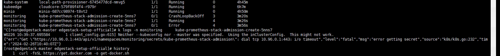
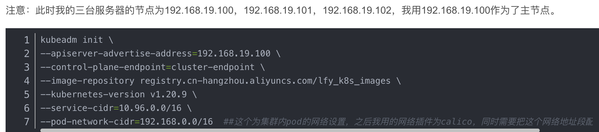

环境

| **角色** | **IP** |
| --- | --- |
| master | 10.10.101.49 |
| node1 | 10.10.101.50 |
| node2 | 10.10.101.51 |

关闭防火墙：firewalld与iptables互斥。一个是白名单一个是黑名单，k8s使用了iptables做流量转发，所以关闭。
```
systemctl stop firewalld.service
systemctl disable firewalld.service
```
关闭selinux: #用来加强安全性的一个组件，但非常容易出错难以定位，一般装完系统就先禁用了
```
sudo setenforce 0 #临时关闭
sudo sed -i 's/^SELINUX=enforcing$/SELINUX=permissive/' /etc/selinux/config
```
关闭swap分区：#当内存不足时，linux会自动使用swap，将部分数据存储放到磁盘中，这样会使性能下降，为了性能考虑推荐关掉
```
swapoff -a  # 临时
sed -ri 's/.*swap.*/#&/' /etc/fstab    # 永久
# 关闭完swap后，一定要重启一下虚拟机！！！
```
设置主机名：
```
hostnamectl set-hostname  <hostname>
# hostnamectl set-hostname  master
```
在master添加hosts: #在master上执行，方便master与其他主机通信
```
[root@master ~]# cat /etc/hosts
127.0.0.1 localhost localhost.localdomain localhost4 localhost4.localdomain4
::1 localhost localhost.localdomain localhost6 localhost6.localdomain6
10.10.101.49 master
10.10.101.50 node1
10.10.101.51 node2
```
允许 [iptables](https://so.csdn.net/so/search?q=iptables&spm=1001.2101.3001.7020) 检查桥接流量：#确保 br_netfilter 模块被加载，为了让Linux 节点上的 iptables 能够正确地查看桥接流量
```
cat <<EOF | sudo tee /etc/modules-load.d/k8s.conf
br_netfilter
EOF

cat <<EOF | sudo tee /etc/sysctl.d/k8s.conf
net.bridge.bridge-nf-call-ip6tables = 1
net.bridge.bridge-nf-call-iptables = 1
EOF
sudo sysctl --system
```
时间同步：（[k8s](https://so.csdn.net/so/search?q=k8s&spm=1001.2101.3001.7020)涉及证书，证书对时间很敏感）
```
yum install ntpdate -y
ntpdate time.windows.com
```
### 安装Docker/kubeadm/kubelet(所有节点)
如果没有装wget，需要先装一下
```
# 对于Debian/Ubuntu系统
sudo apt-get install wget
# 对于CentOS/RHEL系统
sudo yum install wget -y
```
安装docekr
```
wget https://mirrors.aliyun.com/docker-ce/linux/centos/docker-ce.repo -O /etc/yum.repos.d/docker-ce.repo
yum -y install docker-ce-18.06.1.ce-3.el7
systemctl enable docker && systemctl start docker
docker --version
# 配置镜像加速器：（此处代码可能复制不了，手打或者去阿里云控制台复制）
sudo tee /etc/docker/daemon.json <<-'EOF'
{
"registry-mirrors": ["https://mcxfjzdt.mirror.aliyuncs.com"]
}
EOF
```
添加阿里云YUM软件源
```
cat <<EOF > /etc/yum.repos.d/kubernetes.repo
[kubernetes]
name=Kubernetes
baseurl=https://mirrors.aliyun.com/kubernetes/yum/repos/kubernetes-el7-x86_64/
enabled=1
gpgcheck=1
repo_gpgcheck=1
gpgkey=https://mirrors.aliyun.com/kubernetes/yum/doc/yum-key.gpg https://mirrors.aliyun.com/kubernetes/yum/doc/rpm-package-key.gpg
EOF
```
安装kubeadm，kubelet和kubectl
```
yum install -y kubelet-1.18.0 kubeadm-1.18.0 kubectl-1.18.0
systemctl enable kubelet
```
将docker的启动引擎cgroupfs驱动改为修改为systemd与kuberlet一致: （docker默认cgroup的驱动是cgroupfs，而k8s的cgroup驱动是systemd,k8s只是一个平台，需要与容器引擎驱动一致）
修改docker的配置文件
新建**/etc/docker/daemon.json**文件，添加以下内容。
```
"exec-opts": ["native.cgroupdriver=systemd"]
```
重启docker让配置文件生效：
```
systemctl daemon-reload
systemctl restart docker
```
### 部署Kubernetes Master
在10.10.101.49（Master）执行。
```
kubeadm init \
      --apiserver-advertise-address=10.10.101.49 \
      --image-repository registry.aliyuncs.com/google_containers \
      --kubernetes-version v1.18.0 \
      --service-cidr=10.96.0.0/12 \
      --pod-network-cidr=10.244.0.0/16

# 参数含义：
# –apiserver-advertise-address 集群通告地址，与node节点上通信的地址
# –pod-network-cidr pod网络，与下面网络插件yaml中保持一致，注意不要和本机所在网络冲突
# –service-cidr 集群内部网络访问地址
# –image-repository 由于默认拉取镜像地址k8s.grc.io国内无法无法访问，这里指定一般手动指定国内仓库
# –kubernetes-version k8s服务端版本与上面一致kubeadm、kubelet、kubectl（客户端）一致，我们指定了版本后就在google仓库会为我们拉取与客户端版本相同的镜像
```
使用kubectl工具
```
mkdir -p $HOME/.kube
sudo cp -i /etc/kubernetes/admin.conf $HOME/.kube/config
sudo chown $(id -u):$(id -g) $HOME/.kube/config
kubectl get nodes
```
[补充知识] k8s初始化（kubeadm init ）做了哪些工作？

- [preflight] 环境检查和拉取master节点所需镜像
- [certs] 创建证书目录/etc/kubernetes/pki，并生成证书
- [kubeconfig] 创建连接apiserver的配置文件目录/etc/kubernetes
- [kubelet-start] 生成k8s配置文件/var/lib/kubelet/kubeadm-flags.env 和启动k8s，前面没有启动就是这原因，如果没有此文件是启动不了的
- [control-plane] 使用静态pod启动master组件/etc/kubernetes/manifests
- [upload-config] [kubelet] [upload-certs] 使用ConfigMap存储k8s配置文件，上传配置文件，上传组件
- [mark-control-plane] 给master节点添加标签
- [bootstrap-token] k8s自动生成证书机制
- [addons] 安装插件CoreDNS、kube-proxy

命令补全（可选）
```
(base) [root@kubuflow ~]# yum -y install bash-completion  #安装补全命令的包
(base) [root@kubuflow ~]# kubectl completion bash
(base) [root@kubuflow ~]# source /usr/share/bash-completion/bash_completion
(base) [root@kubuflow ~]# kubectl completion bash >/etc/profile.d/kubectl.sh
(base) [root@kubuflow ~]# source /etc/profile.d/kubectl.sh
(base) [root@kubuflow ~]# cat  >>  /root/.bashrc <<EOF
source /etc/profile.d/kubectl.sh
EOF
(base) [root@kubuflow ~]# echo $SHELL
(base) [root@kubuflow ~]# vi ~/.bash_profile
添加 alias k=kubectl

```
解除master限制(可选)
默认k8s的master节点是不能跑pod的业务，需要执行以下命令解除限制
```
kubectl taint nodes --all node-role.kubernetes.io/master-
```
### 部署node节点
```
## node节点hostname命名
hostnamectl set-hostname node1
hostnamectl set-hostname node2

kubeadm join 10.10.101.49:6443 --token o967qs.ibi1mydhl5ktzhpl \
    --discovery-token-ca-cert-hash sha256:1ddce21bfedb81bf1c559100885d9c200dfa3b380103f30ad951b3edebc70a6e
```
默认token有效期为24小时，当过期之后，该token就不可用了。这时就需要在master节点重新创建token，操作如下：
```
kubeadm token create --print-join-command
```
查看节点状态NotReady，coredns pending是因为没有部署flannel网络
```
kubectl get node
NAME     STATUS     ROLES    AGE    VERSION
master   NotReady   master   135m   v1.18.0
node1    NotReady   <none>   39m    v1.18.0
node2    NotReady   <none>   35m    v1.18.0

kubectl get pods -n kube-system
NAME                             READY   STATUS    RESTARTS   AGE
coredns-7ff77c879f-q5vqm         0/1     Pending   0          17h
coredns-7ff77c879f-snp7r         0/1     Pending   0          17h
etcd-master                      1/1     Running   0          17h
kube-apiserver-master            1/1     Running   0          17h
kube-controller-manager-master   1/1     Running   0          17h
kube-proxy-4gpgt                 1/1     Running   0          17h
kube-proxy-4hhnn                 1/1     Running   0          15h
kube-proxy-h589f                 1/1     Running   0          15h
kube-scheduler-master            1/1     Running   0          17h
```
部署flannel网络
```
kubectl apply -f https://github.com/flannel-io/flannel/releases/latest/download/kube-flannel.yml
```
calico参考
```
https://www.cnblogs.com/cyh00001/p/16833584.html
```
查看coredns及节点是否正常
```
kubectl get pods -n kube-system
NAME                             READY   STATUS    RESTARTS   AGE
coredns-7ff77c879f-q5vqm         1/1     Running   0          17h
coredns-7ff77c879f-snp7r         1/1     Running   0          17h
etcd-master                      1/1     Running   0          17h
kube-apiserver-master            1/1     Running   0          17h
kube-controller-manager-master   1/1     Running   0          17h
kube-proxy-4gpgt                 1/1     Running   0          17h
kube-proxy-4hhnn                 1/1     Running   0          15h
kube-proxy-h589f                 1/1     Running   0          15h
kube-scheduler-master            1/1     Running   0          17h

kubectl get node
NAME     STATUS   ROLES    AGE   VERSION
master   Ready    master   17h   v1.18.0
node1    Ready    <none>   15h   v1.18.0
node2    Ready    <none>   15h   v1.18.0
```
### 迁移
1、导出所有想要迁移的k8s 资源
```
kubectl get deployment,configmap, secret,service -o yaml --all l-namespaces > back.yaml
```

2、切换到目标集群，执行apply
```
kubectl apply -f back.yaml
```
### 卸载
```
kubeadm reset -f
# 从Linux内核中卸载名为 "ipip" 的内核模块
modprobe -r ipip
# 列出当前加载到 Linux 内核中的模块的命令
lsmod
rm -rf ~/.kube/
rm -rf /etc/kubernetes/
rm -rf /etc/systemd/system/kubelet.service.d
rm -rf /etc/systemd/system/kubelet.service
rm -rf /usr/bin/kube*
rm -rf /etc/cni
rm -rf /opt/cni
rm -rf /var/lib/etcd
rm -rf /var/etcd
rm -rf $HOME/.kube

# 会清除所有的缓存，缓存文件通常存储在 /var/cache/yum/ 目录下。清除缓存的目的是为了释放磁盘空间并确保 yum 使用最新的元数据信息，以便从软件源中正确获取软件包信息
yum clean all
yum remove kube*
```
### 常见问题
### dial tcp 10.96.0.1:443: i/o timeout问题解析

出现这种问题的原因是因为创建k8s集群的时候，初始化主节点时网络地址段出现重叠导致的

可以看到我这里初始化时apiserver-advertise-address=192.168.19.100，而pod-network-cidr=192.168.0.0/16，此时可以发现我的服务器的ip地址在k8s的集群网络地址段中，这就导致在分配网络的时候会出现问题，在安装组件的时候导致工作节点和主之前无法互访，导致安装失败。
这时可以把组件安装到主节点可以安装成功，但是治标不治本，可能会出现其他问题。可以参考我另一篇文章把组件强制安装到master节点
[https://blog.csdn.net/qq_44847649/article/details/123082308?spm=1001.2014.3001.5502](https://blog.csdn.net/qq_44847649/article/details/123082308?spm=1001.2014.3001.5502)
要是想彻底解决只能重新安装k8s集群。
```
kubeadm init \
--apiserver-advertise-address=192.168.19.100 \
--control-plane-endpoint=cluster-endpoint \
--image-repository registry.cn-hangzhou.aliyuncs.com/lfy_k8s_images \
--kubernetes-version v1.20.9 \
--service-cidr=10.96.0.0/16 \
--pod-network-cidr=192.169.0.0/16
```
#### pod状态NodePorts
大概率端口占用，同一个pod，用hostnetwork，启动2个实例，就会报这个错
```
先edit deploy replicate 0
然后删除pod
kubectl get pods --field-selector=status.phase!=Running -o wide -n ekuiper | grep NodePorts | awk '{print $1}' | xargs kubectl delete pod -n ekuiper
再处理
```
