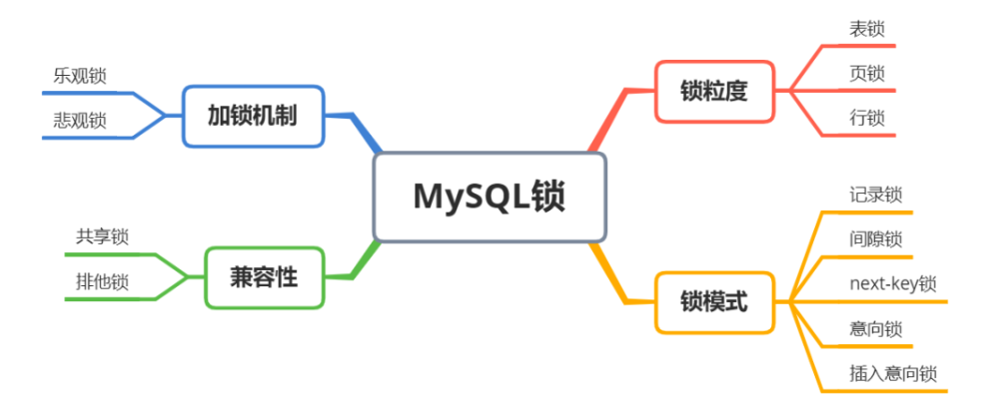
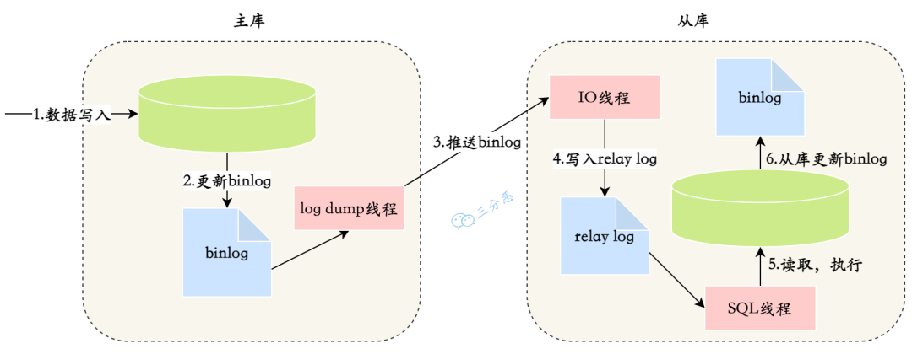
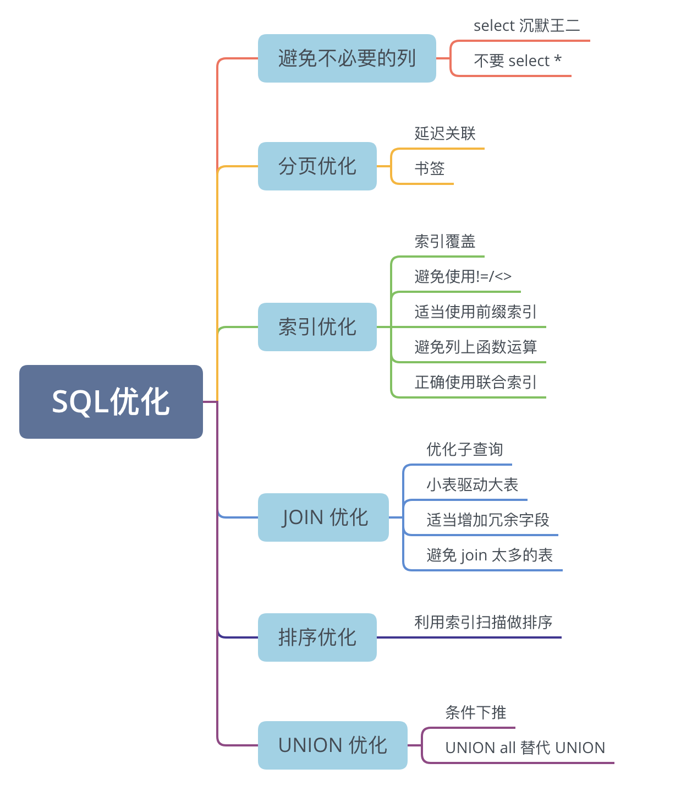
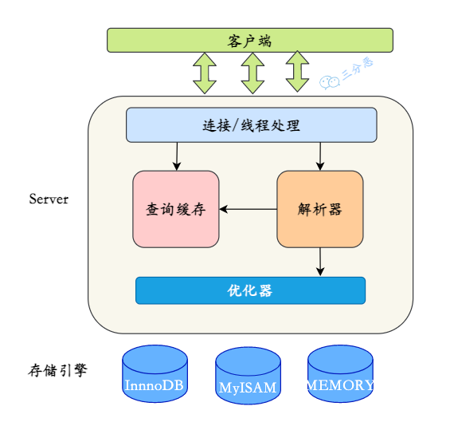

## docker 启动
```plain
docker pull registry.cn-hangzhou.aliyuncs.com/guxc-images/mysql
docker run --name mysql-container -e MYSQL_ROOT_PASSWORD=my-secret-pw -d registry.cn-hangzhou.aliyuncs.com/guxc-images/mysql:latest
docker exec -it mysql-container mysql -uroot -p
my-secret-pw
```


## 索引
### 为什么索引加快查询
没有索引时，数据库进行全表扫描，这意味着它必须读取表中的每一行数据来查找匹配的行（时间效率为 O(n)）

有了索引，就可以直接跳到索引指示的数据位置，而不必扫描整张表，从而大大减少了磁盘 I/O 操作的次数。

MySQL 的 InnoDB 存储引擎默认使用 B+ 树来作为索引的数据结构，而 B+ 树的查询效率非常高，时间复杂度为 O(logN)。

索引文件相较于数据库文件，体积小得多，查到索引之后再映射到数据库记录，查询效率就会高很多。

可通过 create index 创建索引，比如：

```plain
create index idx_name on students(name);
```

### 索引分类
#### 功能上分类
##### 主键索引
表中每行数据唯一标识的索引，强调列值的唯一性和非空性。

当创建表的时候，可以直接指定主键索引：

```plain
CREATE TABLE users (
    id INT AUTO_INCREMENT PRIMARY KEY,
    username VARCHAR(255) NOT NULL,
    email VARCHAR(255)
);
```

id 列被指定为主键索引，同时，MySQL 会自动为这个列创建一个聚簇索引（主键索引一定是聚簇索引）。

可以通过 show index from table_name 查看索引信息，比如前面创建的 users 表：

##### 唯一索引
保证数据列中每行数据的唯一性，但允许有空值。

```plain
CREATE UNIQUE INDEX idx_username ON users(username);
```

##### 普通索引
基本的索引类型，用于加速查询。

```plain
CREATE INDEX idx_email ON users(email);
```

##### 全文索引
特定于文本数据的索引，用于提高文本搜索的效率。

假设有一个名为 articles 的表，下面这条语句在 content 列上创建了一个全文索引。

```plain
CREATE FULLTEXT INDEX idx_article_content ON articles(content);
```


#### 结构上分类
##### B+数索引
**InnoDB 存储引擎的默认索引类型**。

B+ 树是 B 树的升级版，B+ 树中的非叶子节点都不存储数据，只存储索引。叶子节点中存储了所有的数据，并且构成了一个从小到大的有序双向链表，使得在完成一次树的遍历定位到范围查询的起点后，可以直接通过叶子节点间的指针顺序访问整个查询范围内的所有记录，而无需对树进行多次遍历。这在处理大范围的查询时特别高效。

```plain
CREATE TABLE example_btree (
    id INT AUTO_INCREMENT PRIMARY KEY,
    name VARCHAR(255),
    INDEX name_index (name)
) ENGINE=InnoDB;
//因为 B+ 树是 InnoDB 的默认索引类型，所以创建 B+ 树的时候不需要指定索引类型。
```

##### hash索引
基于哈希表的索引，查询效率可以达到 O(1)，但是只适合 = 和 in 查询，不适合范围查询。

```plain
CREATE TABLE example_hash (
    id INT AUTO_INCREMENT PRIMARY KEY,
    name VARCHAR(255),
    UNIQUE HASH (name)
) ENGINE=MEMORY;
//InnoDB 并不提供直接创建哈希索引的选项
```

#### 存储位置分类
##### 聚簇索引
聚簇索引的叶子节点保存了一行记录的所有列信息。也就是说，聚簇索引的叶子节点中，包含了一个完整的记录行。

##### 非聚簇索引
它的叶子节点只包含一个主键值，通过非聚簇索引查找记录要先找到主键，然后通过主键再到聚簇索引中找到对应的记录行，这个过程被称为回表。


InnoDB 存储引擎的主键使用的是聚簇索引，MyISAM 存储引擎不管是主键索引，还是二级索引使用的都是非聚簇索引。


### 创建索引注意点：
1. 选择合适的列作为索引
    1. 经常作为查询条件（WHERE 子句）、排序条件（ORDER BY 子句）、分组条件（GROUP BY 子句）的列是建立索引的好候选
    2. 区分度低的字段，例如性别，不要建索引
    3. 频繁更新的字段，不要作为主键或者索引
2. 避免过多的索引
    1. 每个索引都需要占用额外的磁盘空间。
    2. 更新表（INSERT、UPDATE、DELETE 操作）时，所有的索引都需要被更新。
    3. 维护索引文件需要成本；还会导致页分裂，IO 次数增多。
3. 利用前缀索引和索引列的顺序
    1. 对于字符串类型的列，可以考虑使用前缀索引来减少索引大小。
    2. 在创建复合索引时，应该根据查询条件将最常用作过滤条件的列放在前面。


### 索引失效
+ **在索引列上使用函数或表达式**：如果在查询中对索引列使用了函数或表达式，那么索引可能无法使用，因为数据库无法预先计算出函数或表达式的结果。例如：SELECT * FROM table WHERE YEAR(date_column) = 2021。
+ 使用不等于（<>）或者 NOT 操作符：这些操作符通常会使索引失效，因为它们会扫描全表。
+ **使用 LIKE 操作符，但是通配符在最前面**：如果 LIKE 的模式串是以“%”或者“_”开头的，那么索引也无法使用。例如：SELECT * FROM table WHERE column LIKE '%abc'。
+ **OR 操作符**：如果查询条件中使用了 OR，并且 OR 两边的条件分别涉及不同的索引，那么这些索引可能都无法使用。
+ 如果 MySQL 估计使用全表扫描比使用索引更快时（通常是小表或者大部分行都满足 WHERE 子句），也不会使用索引。
+ 联合索引不满足最左前缀原则时，索引会失效。

### 索引不适合哪些场景
+ **数据表较小**：当表中的数据量很小，或者查询需要扫描表中大部分数据时，数据库优化器可能会选择全表扫描而不是使用索引。在这种情况下，维护索引的开销可能大于其带来的性能提升。
+ **频繁更新的列**：对于经常进行更新、删除或插入操作的列，使用索引可能会导致性能下降。因为每次数据变更时，索引也需要更新，这会增加额外的写操作负担。


### 区分度
区分度 = 字段的唯一值数量 / 字段的总记录数；

接近 1，字段值大部分是唯一的。例如，用户的唯一 ID，一般都是主键索引。

接近 0，则说明字段值重复度高。

一个表中有 1000 条记录，其中性别字段只有两个值（男、女），那么性别字段的区分度只有 0.002。

```plain
SELECT 
    COUNT(DISTINCT gender) / COUNT(*) AS gender_selectivity
FROM 
    users;
```


### 索引是不是建的越多越好呢
当然不是。

+ **索引会占据磁盘空间**
+ **索引虽然会提高查询效率，但是会降低更新表的效率**。比如每次对表进行增删改操作，MySQL 不仅要保存数据，还有保存或者更新对应的索引文件。


### 为什么 InnoDB 要使用 B+树作为索引
MySQL 的默认存储引擎是 InnoDB，它采用的是 B+树索引，B+树是一种自平衡的多路查找树，和红黑树、二叉平衡树不同，B+树的每个节点可以有 m 个子节点，而红黑树和二叉平衡树都只有 2 个。

和 B 树不同，B+树的非叶子节点只存储键值，不存储数据，而叶子节点存储了所有的数据，并且构成了一个有序链表。

这样做的好处是，非叶子节点上由于没有存储数据，就可以存储更多的键值对，再加上叶子节点构成了一个有序链表，范围查询时就可以直接通过叶子节点间的指针顺序访问整个查询范围内的所有记录，而无需对树进行多次遍历。查询的效率会更高。


### B+树的页是单向链表还是双向链表？如果从大值向小值检索，如何操作？
B+树的叶子节点是通过双向链表连接的，这样可以方便范围查询和反向遍历。

+ 当执行范围查询时，可以从范围的开始点或结束点开始，向前或向后遍历，这使得查询更为灵活。
+ 在需要对数据进行逆序处理时，双向链表非常有用。

如果需要在 B+树中从大值向小值进行检索，可以按以下步骤操作：

+ 定位到最右侧节点：首先，找到包含最大值的叶子节点。这通常通过从根节点开始向右遍历树的方式实现。
+ 反向遍历：一旦定位到了最右侧的叶子节点，可以利用叶节点间的双向链表向左遍历。


### 为什么 MongoDB 索引用 B树，而 MySQL 用 B+ 树？
B树的特点是每个节点都存储数据，相邻的叶子节点之间没有指针链接。

B+树的特点是非叶子节点只存储索引，叶子节点存储数据，并且相邻的叶子节点之间有指针链接。

那么在查找单条数据时，B 树的查询效率可能会更高，因为每个节点都存储数据，所以最好情况就是 O(1)。

但由于 B 树的节点之间没有指针链接，所以并不适合做范围查询，因为范围查询需要遍历多个节点。

而 B+ 树的叶子节点之间有指针链接，所以适合做范围查询，因为可以直接通过叶子节点间的指针顺序访问整个查询范围内的所有记录，而无需对树进行多次遍历。

MySQL 属于关系型数据库，所以范围查询会比较多，所以采用了 B+树；但 MongoDB 属于非关系型数据库，在大多数情况下，只需要查询单条数据，所以 MongoDB 选择了 B 树。


### 那一棵 B+树能存储多少条数据呢？
假如我们的主键 ID 是 bigint 类型，长度为 8 个字节。指针大小在 InnoDB 源码中设置为 6 字节，这样一共 14 字节。所以非叶子节点(一页)可以存储 16384/14=1170 个这样的单元(键值+指针)。

一个指针指向一个存放记录的页，一页可以放 16 条数据，树深度为 2 的时候，可以存放 1170*16=**18720（1.8w）** 条数据。

同理，树深度为 3 的时候，可以存储的数据为 1170*1170*16=**21902400**条记录（2kw）。

理论上，在 InnoDB 存储引擎中，B+树的高度一般为 2-4 层，就可以满足千万级数据的存储。查找数据的时候，一次页的查找代表一次 IO，当我们通过主键索引查询的时候，最多只需要 2-4 次 IO 就可以了。


### innodb 使用数据页存储数据？默认数据页大小 16K，我现在有一张表，有 2kw 数据，我这个 b+树的高度有几层？
在 MySQL 中，InnoDB 存储引擎的最小存储单元是页，默认大小是 16k，可通过参数设置。页可以用来存储 B+树叶子节点上的数据，也可以存放非叶子节点上的键值对。

假设一行数据的大小为 1KB，那么一页的叶子节点就可以存储 16 条数据。对于 3 层的 B+树，第一层叶子节点数*第二层叶子节点数*一页能够存储的数据量 = 1170*1170*16 = 21902400 条数据。


### 为什么要用 B+ 树，而不用普通二叉树？
普通二叉树存在退化的情况，如果它退化成链表，就相当于全表扫描。

### 为什么不用平衡二叉树呢？
读取数据的时候，是从磁盘先读到内存。平衡二叉树的每个节点只存储一个键值和数据，而 B+ 树可以存储更多的节点数据，树的高度也会降低，因此读取磁盘的次数就会下降，查询效率就快。


### 为什么用 B+ 树而不用 B 树呢？
B+ 树相比较 B 树，有这些优势：

1. **更高的查询效率**

B+树的所有值（数据记录或指向数据记录的指针）都存在于叶子节点，并且叶子节点之间通过指针连接，形成一个有序链表。

这种结构使得 B+树非常适合进行范围查询——一旦到达了范围的开始位置，接下来的元素可以通过遍历叶子节点的链表顺序访问，而不需要回到树的上层。如 SQL 中的 ORDER BY 和 BETWEEN 查询。

而 B 树的数据分布在整个树中，进行范围查询时可能需要遍历树的多个层级。

2. **更高的空间利用率**

在 B+树中，非叶子节点不存储数据，只存储键值，这意味着非叶子节点可以拥有更多的键，从而有更多的分叉。

这导致树的高度更低，进一步降低了查询时磁盘 I/O 的次数，因为每一次从一个节点到另一个节点的跳转都可能涉及到磁盘 I/O 操作。

3. **查询效率更稳定**

B+树中所有叶子节点深度相同，所有数据查询路径长度相等，保证了每次搜索的性能稳定性。而在 B 树中，数据可以存储在内部节点，不同的查询可能需要不同深度的搜索。


### Hash 索引和 B+ 树索引区别是什么？
+ B+ 树索引可以进行范围查询，Hash 索引不能。
+ B+ 树索引支持联合索引的最左侧原则，Hash 索引不支持。
+ B+ 树索引支持 order by 排序，Hash 索引不支持。
+ Hash 索引在等值查询上比 B+ 树索引效率更高。
+ B+ 树使用 like 进行模糊查询的时候，LIKE 'abc%' 的话可以起到索引优化的作用，Hash 索引无法进行模糊查询。


### MySQL 模糊查询怎么查，什么情况下模糊查询不走索引？
MySQL 中进行模糊查询主要使用 LIKE 语句，结合通配符 %（代表任意多个字符）和 _（代表单个字符）来实现。

```plain
SELECT * FROM table WHERE column LIKE '%xxx%';
```

但是，如果模糊查询的通配符 % 出现在搜索字符串的开始位置，如 LIKE '%xxx'，MySQL 将无法使用索引，因为数据库必须扫描全表以匹配任意位置的字符串。


### 聚簇索引与非聚簇索引的区别？
在 MySQL 的 InnoDB 存储引擎中，主键就是聚簇索引。聚簇索引不是一种新的索引，而是一种**数据存储方式**。

在聚簇索引中，表中的行是按照键值（索引）的顺序存储的。这意味着表中的实际数据行和键值之间存在物理排序的关系。因此，每个表只能有一个聚簇索引。

在非聚簇索引中，索引和数据是分开存储的，索引中的键值指向数据的实际存储位置。因此，非聚簇索引也被称为二级索引或辅助索引或非主键索引。表可以有多个非聚簇索引。

这意味着，当使用非聚簇索引检索数据时，数据库首先在索引中查找，然后通过索引中的指针去访问表中实际的数据行，这个过程称为“回表”（Bookmark Lookup）。

+ InnoDB 采用的是聚簇索引，如果没有显式定义主键，InnoDB 会选择一个唯一的非空列作为隐式的聚簇索引；如果这样的列也不存在，InnoDB 会自动生成一个隐藏的行 ID 作为聚簇索引。这意味着数据与主键是紧密绑定的，行数据直接存储在索引的叶子节点上。
+ MyISAM 采用的是非聚簇索引，表数据存储在一个地方，而索引存储在另一个地方，索引指向数据行的物理位置。


### 回表了解吗？
回表是指在数据库查询过程中，通过非聚簇索引（secondary index）查找到记录的主键值后，再根据这个主键值到聚簇索引（clustered index）中查找完整记录的过程。

回表操作通常发生在使用非聚簇索引进行查询，但查询的字段不全在该索引中，必须通过主键进行再次查询以获取完整数据。

例如：select * from user where name = '张三';，会先从辅助索引中找到 name='张三' 的主键 ID，然后再根据主键 ID 从主键索引中找到对应的数据行。


### 回表记录越多好吗？
回表记录越多并不是一件好事。事实上，回表的代价是很高的，尤其在记录较多时，回表操作会显著影响查询性能。

因为每次回表操作都需要进行一次磁盘 I/O 读取操作。如果回表记录很多，会导致大量的磁盘 I/O。

索引覆盖（Covering Index）可以减少回表操作，将查询的字段都放在索引中，这样不需要回表就可以获取到查询结果了。


### 覆盖索引了解吗？
在辅助索引里面，不管是单列索引还是联合索引，如果 select 的数据列只用辅助索引中就能够取得，不用去查主键索引，这时候使用的索引就叫做覆盖索引，避免了回表。


### 什么是最左前缀原则？
最左前缀原则，也叫最左匹配原则，或者最左前缀匹配原则。

最左匹配原则是指在使用联合索引（即包含多列的索引）时，查询条件从索引的最左列开始并且不跳过中间的列。

如果一个复合索引包含(col1, col2, col3)，那么它可以支持 col1、col1,col2 和 col1, col2, col3 的查询优化，但不会优化只有 col2 或 col3 的查询。

也就说，在进行查询时，如果没有遵循最左前缀，那么索引可能不会被利用，导致查询效率降低。

当我们使用 where name= '张三' and age = '20' 去查询的时候， B+ 树会优先比较 name 来确定下一步应该搜索的方向，往左还是往右。

如果 name 相同的时候再比较 age。

但如果查询条件没有 name，就不知道应该怎么查了，因为 name 是 B+树中的前置条件，没有 name，索引就派不上用场了。


### 什么是索引下推优化？
+ 不使用索引条件下推优化时存储引擎通过索引检索到数据，然后返回给 MySQL Server，MySQL Server 进行过滤条件的判断。
+ 当使用索引条件下推优化时，如果存在某些被索引的列的判断条件时，MySQL Server 将这一部分判断条件**下推**给存储引擎，然后由存储引擎通过判断索引是否符合 MySQL Server 传递的条件，只有当索引符合条件时才会将数据检索出来返回给 MySQL 服务器。


例如一张表，建了一个联合索引（name, age），查询语句：select * from t_user where name like '张%' and age=10;，由于name使用了范围查询，根据最左匹配原则：

不使用 ICP，引擎层查找到name like '张%'的数据，再由 Server 层去过滤age=10这个条件，这样一来，就回表了两次，浪费了联合索引的另外一个字段age。

但是，使用了索引下推优化，把 where 的条件放到了引擎层执行，直接根据name like '张%' and age=10的条件进行过滤，减少了回表的次数。

索引条件下推优化可以减少存储引擎查询基础表的次数，也可以减少 MySQL 服务器从存储引擎接收数据的次数。


### MySQL如何查看查询是否用到了索引
可以通过 EXPLAIN 关键字来查看是否使用了索引。

```plain
EXPLAIN SELECT * FROM table WHERE column = 'value';
```

其结果中的 key 值显示了查询是否使用索引，如果使用了索引，会显示索引的名称。比如下面这个截图就表明该查询语句使用了主键索引。

```plain
key: PRIMARY
```


### 联合索引(A,B,C)
#### 联合索引 select * from tbn where a=? and b in (?,?) and c>? 会走索引吗
这个查询会使用到联合索引 (A,B,C)，因为条件是按照索引列 A、B、C 的顺序来的，这是理想的使用场景。

1. 对于 A=?：这个条件是一个精确匹配，MySQL 会使用索引来定位到满足条件 A=? 的记录。
2. 对于 B IN (?, ?)：这个条件指定了 B 列可以取两个可能的值。MySQL 会利用索引来查找所有匹配 A=? 且 B 列为这两个值中任意一个的记录。
3. 对于 C>?：这个条件是一个范围查询。在已经根据 A 和 B 筛选的基础上，MySQL 会继续利用索引来查找 C 列值大于指定值的记录。

```plain
EXPLAIN SELECT * FROM tbn WHERE A=1 AND B IN (2, 3) AND C>3\G
```

#### a=1,c=1
```plain
EXPLAIN SELECT * FROM tbn WHERE A=1 AND C=1\G
```

key 是 idx_abc，表明 a=1,c=1 会使用联合索引。但因为缺少了 B 字段的条件，所以 MySQL 可能无法利用索引来直接定位到精确的行，而是使用索引来缩小搜索范围。

最终，MySQL 需要检查更多的行（rows: 3）来找到满足所有条件的结果集，但总体来说，使用索引明显比全表扫描要高效得多。

#### b=1,c=1
```plain
EXPLAIN SELECT * FROM tbn WHERE B=1 AND C=1\G
```

key 是 NULL，表明 b=1,c=1 不会使用联合索引。这是因为查询条件中涉及的字段 B 和 C 没有遵循之前定义的联合索引 idx_abc（A、B、C 顺序）的最左前缀原则。

在 idx_abc 索引中，A 是最左边的列，但是查询没有包含 A，因此 MySQL 无法利用这个索引。

#### a=1,c=1,b=1
key 是 idx_abc，表明 a=1,c=1,b=1 会使用联合索引。

并且 rows=1，因为查询条件包含了联合索引 idx_abc 中所有列的等值条件，并且条件的顺序与索引列的顺序相匹配，使得查询能够准确、快速地定位到目标数据。


## 锁
### 分类

**按锁粒度划分的话，MySQL 的锁有：**

+ 表锁：开销小，加锁快；锁定力度大，发生锁冲突概率高，并发度最低;不会出现死锁。
+ 行锁：开销大，加锁慢；会出现死锁；锁定粒度小，发生锁冲突的概率低，并发度高。
+ 页锁：开销和加锁速度介于表锁和行锁之间；会出现死锁；锁定粒度介于表锁和行锁之间，并发度一般


**按兼容性划分的话，MySQL 的锁有：**

+ 共享锁（S Lock）,也叫读锁（read lock），相互不阻塞，多个事务对于同一数据可以共享一把锁，都能访问到最新数据。 如果只有一个事务拿到了共享锁，则该事务可以对数据进行UPDATE DETELE 等操作。 如果有多个事务拿到了共享锁，则所有事务都不能对数据进行UPDATE DETELE 等操作。
+ 排他锁（X Lock），也叫写锁（write lock），排它锁是阻塞的，在一定时间内，只有一个请求能执行写入，并阻止其它锁读取正在写入的数据。

  
**按加锁机制划分****，MySQL 的锁有：**

+ **乐观锁，**不会频繁地去锁定资源。相反，它在提交更新的时候才检查是否有其他事务已经修改了数据。

可以通过在数据表中使用版本号（Version）或时间戳（Timestamp）来实现，每次读取记录时，同时获取版本号或时间戳，更新时检查版本号或时间戳是否发生变化。

如果没有变化，则执行更新并增加版本号或更新时间戳；如果检测到冲突（即版本号或时间戳与之前读取的不同），则拒绝更新。

+ **悲观锁**

悲观锁假设冲突是常见的，因此在数据处理过程中，它会主动锁定数据，防止其他事务进行修改。

可以直接使用数据库的锁机制，如行锁或表锁，来锁定被访问的数据。常见的实现是 SELECT FOR UPDATE 语句，它在读取数据时就加上了锁，直到当前事务提交或回滚后才释放。


### 库存超卖
按照乐观锁的方式：

```plain
UPDATE inventory SET count = count - 1, version = version + 1 WHERE product_id = 1 AND version = current_version;
```

按照悲观锁的方式：

在事务开始时直接锁定库存记录，直到事务结束。

```plain
START TRANSACTION;
SELECT * FROM inventory WHERE product_id = 1 FOR UPDATE;
UPDATE inventory SET count = count - 1 WHERE product_id = 1;
COMMIT;
```


### 说说 InnoDB 里的行锁实现?
行锁的三种实现算法

+ **Record Lock 记录锁**

记录锁就是直接锁定某行记录。当我们使用唯一性的索引(包括唯一索引和聚簇索引)进行等值查询且精准匹配到一条记录时，此时就会直接将这条记录锁定。例如select * from t where id =6 for update;就会将id=6的记录锁定。

+ **Gap Lock 间隙锁**

间隙锁(Gap Locks) 的间隙指的是两个记录之间逻辑上尚未填入数据的部分,是一个**左开右开空间**。

间隙锁就是锁定某些间隙区间的。当我们使用用等值查询或者范围查询，并且没有命中任何一个record，此时就会将对应的间隙区间锁定。例如select * from t where id =3 for update;或者select * from t where id > 1 and id < 6 for update;就会将(1,6)区间锁定。

+ **Next-key Lock 临键锁**

临键指的是间隙加上它右边的记录组成的**左开右闭区间**。比如上述的(1,6]、(6,8]等。

临键锁就是记录锁(Record Locks)和间隙锁(Gap Locks)的结合，即除了锁住记录本身，还要再锁住索引之间的间隙。当我们使用范围查询，并且命中了部分record记录，此时锁住的就是临键区间。注意，临键锁锁住的区间会包含最后一个 record 的右边的临键区间。例如select * from t where id > 5 and id <= 7 for update;会锁住(4,7]、(7,+∞)。


mysql 默认行锁类型就是临键锁(Next-Key Locks)。当使用唯一性索引，等值查询匹配到一条记录的时候，临键锁(Next-Key Locks)会退化成记录锁；没有匹配到任何记录的时候，退化成间隙锁。


上面是行锁的三种实现算法，除此之外，在行上还存在插入意向锁。

+ **Insert Intention Lock 插入意向锁**

一个事务在插入一条记录时需要判断一下插入位置是不是被别的事务加了意向锁 ，如果有的话，插入操作需要等待，直到拥有 gap 锁 的那个事务提交。但是事务在等待的时候也需要在内存中生成一个 锁结构 ，表明有事务想在某个 间隙 中插入新记录，但是现在在等待。这种类型的锁命名为 Insert Intention Locks ，也就是插入意向锁 。

假如我们有个 T1 事务，给(1,6)区间加上了意向锁，现在有个 T2 事务，要插入一个数据，id 为 4，它会获取一个（1,6）区间的插入意向锁，又有有个 T3 事务，想要插入一个数据，id 为 3，它也会获取一个（1,6）区间的插入意向锁，但是，这两个插入意向锁锁不会互斥。


### 意向锁是什么知道吗
意向锁是一个表级锁，不要和插入意向锁搞混。

它解决的是表锁和行锁共存的问题。

当我们需要给一个表加表锁的时候，我们需要根据去判断表中有没有数据行被锁定，以确定是否能加成功。

假如没有意向锁，那么我们就得遍历表中所有数据行来判断有没有行锁；

有了意向锁这个表级锁之后，则我们直接判断一次就知道表中是否有数据行被锁定了。

有了意向锁之后，要执行的事务 A 在申请行锁（写锁）之前，**数据库会自动先给事务 A 申请表的意向排他锁。**当事务 B 去申请表的互斥锁时就会失败，因为表上有意向排他锁之后事务 B 申请表的互斥锁时会被阻塞。


### MySQL 的乐观锁和悲观锁了解吗
+ 悲观锁

悲观锁认为被它保护的数据是极其不安全的，每时每刻都有可能被改动，一个事务拿到悲观锁后，其他任何事务都不能对该数据进行修改，只能等待锁被释放才可以执行。

数据库中的行锁，表锁，读锁，写锁均为悲观锁。

+ 乐观锁

乐观锁认为数据的变动不会太频繁。

乐观锁通常是通过在表中增加一个版本(version)或时间戳(timestamp)来实现，其中，版本最为常用。

事务在从数据库中取数据时，会将该数据的版本也取出来(v1)，当事务对数据变动完毕想要将其更新到表中时，会将之前取出的版本 v1 与数据中最新的版本 v2 相对比，如果 v1=v2，那么说明在数据变动期间，没有其他事务对数据进行修改，此时，就允许事务对表中的数据进行修改，并且修改时 version 会加 1，以此来表明数据已被变动。

如果，v1 不等于 v2，那么说明数据变动期间，数据被其他事务改动了，此时不允许数据更新到表中，一般的处理办法是通知用户让其重新操作。不同于悲观锁，乐观锁通常是由开发者实现的。


### MySQL 遇到过死锁问题吗，你是如何解决的
排查死锁的一般步骤是这样的：

（1）查看死锁日志 show engine innodb status;

（2）找出死锁 sql

（3）分析 sql 加锁情况

（4）模拟死锁案发

（5）分析死锁日志

（6）分析死锁结果


添加案例


## 事物
事务是一个或多个 SQL 语句组成的一个执行单元，这些 SQL 语句要么全部执行成功，要么全部不执行，不会出现部分执行的情况。

事务具有四个基本特性，也就是通常所说的 ACID 特性，即原子性（Atomicity）、一致性（Consistency）、隔离性（Isolation）和持久性（Durability）。

### 事务具有四个基本特性
#### 什么是原子性
原子性子性意味着事务中的所有操作要么全部完成，要么全部不完成，它是不可分割的单位。如果事务中的任何一个操作失败了，整个事务都会回滚到事务开始之前的状态，如同这些操作从未被执行过一样。

#### 什么是一致性？
一致性确保事务从一个一致的状态转换到另一个一致的状态。

比如在银行转账事务中，无论发生什么，转账前后两个账户的总金额应保持不变。假如 A 账户（100 块）给 B 账户（10 块）转了 10 块钱，不管成功与否，A 和 B 的总金额都是 110 块。

#### 什么是隔离性？
隔离性意味着并发执行的事务是彼此隔离的，一个事务的执行不会被其他事务干扰。就是事务之间是井水不犯河水的。

隔离性主要是为了解决事务并发执行时可能出现的问题，如脏读、不可重复读、幻读等。

数据库系统通过事务隔离级别（如读未提交、读已提交、可重复读、串行化）来实现事务的隔离性。

#### 什么是持久性？
持久性确保事务一旦提交，它对数据库所做的更改就是永久性的，即使发生系统崩溃，数据库也能恢复到最近一次提交的状态。通常，持久性是通过数据库的恢复和日志机制来实现的，确保提交的事务更改不会丢失。


简短一点的回答可以是：

+ **原子性**：事务的所有操作要么全部提交成功，要么全部失败回滚，对于一个事务中的操作不能只执行其中一部分。
+ **一致性**：事务应确保数据库的状态从一个一致状态转变为另一个一致状态。一致性与业务规则有关，比如银行转账，不论事务成功还是失败，转账双方的总金额应该是不变的。
+ **隔离性**：多个并发事务之间需要相互隔离，即一个事务的执行不能被其他事务干扰。
+ **持久性**：一旦事务提交，则其所做的修改将永久保存到数据库中。即使发生系统崩溃，修改的数据也不会丢失。


### ACID 靠什么保证的呢
MySQL 通过事务、undo log、redo log 来确保 ACID。

#### 如何保证原子性？
MySQL 通过 undo log 来确保原子性（Atomicity）。

当事务开始时，MySQL 会在undo log中记录事务开始前的旧值。如果事务执行失败，MySQL 会使用undo log中的旧值来回滚事务开始前的状态；如果事务执行成功，MySQL 会在某个时间节点将undo log删除。

#### 如何保证隔离性？
MySQL 定义了多种隔离级别，通过 MVCC 来确保每个事务都有专属自己的数据版本，从而实现隔离性（Isolation）。

在 MVCC 中，每行记录都有一个版本号，当事务尝试读取记录时，会根据事务的隔离级别和记录的版本号来决定是否可以读取。

#### 如何保证持久性？
redo log 是一种物理日志，当执行写操作时，MySQL 会先将更改记录到 redo log 中。当 redo log 填满时，MySQL 再将这些更改写入数据文件中。

如果 MySQL 在写入数据文件时发生崩溃，可以通过 redo log 来恢复数据文件，从而确保持久性（Durability）。

#### 如何保证一致性？
如果其他三个特性都得到了保证，那么一致性（Consistency）就自然而然得到保证了。


### 事务的隔离级别有哪些？MySQL 的默认隔离级别是什么
事务的隔离级别定了一个事务可能受其他事务影响的程度，MySQL 支持的四种隔离级别分别是：读未提交（Read Uncommitted）、读已提交（Read Committed）、可重复读（Repeatable Read）和串行化（Serializable）。

#### 什么是读未提交？
读未提交是最低的隔离级别，在这个级别，当前事务可以读取未被其他事务提交的数据，以至于会出现“脏读”、“不可重复读”和“幻读”的问题。

#### 什么是读已提交？
当前事务只能读取已经被其他事务提交的数据，可以避免“脏读”现象。但不可重复读和幻读问题仍然存在。

#### 什么是可重复读？
确保在同一事务中多次读取相同记录的结果是一致的，即使其他事务对这条记录进行了修改，也不会影响到当前事务。

可重复读是 MySQL 默认的隔离级别，避免了“脏读”和“不可重复读”，但可能会出现幻读。

#### 什么是串行化？
最高的隔离级别，通过强制事务串行执行来避免并发问题，可以解决“脏读”、“不可重复读”和“幻读”问题。

但会导致大量的超时和锁竞争问题。

#### A 事务未提交，B 事务上查询到的是旧值还是新值？
在 MySQL 的默认隔离级别（可重复读）下，如果事务 A 修改了数据但未提交，事务 B 将看到修改之前的数据。

这是因为在可重复读隔离级别下，MySQL 将通过多版本并发控制（MVCC）机制来保证一个事务不会看到其他事务未提交的数据，从而确保读一致性。

### 什么是脏读、不可重复读、幻读呢？
#### 脏读
**脏读**指的是一个事务能够读取另一个事务尚未提交的数据。如果读到的数据在之后被回滚了，那么第一个事务读取到的就是无效的数据。

```plain
-- 事务 A
START TRANSACTION;
UPDATE employees SET salary = 5000 WHERE id = 1;

-- 事务 B
START TRANSACTION;
SELECT salary FROM employees WHERE id = 1;  -- 读取到 salary = 5000 (脏读)
ROLLBACK;
```

#### 不可重复读
**不可重复读**指的是在同一事务中执行相同的查询时，返回的结果集不同。这是由于在事务过程中，另一个事务**修改了数据并提交**。

比如说事务 A 在第一次读取某个值后，**事务 B 修改了这个值并提交**，事务 A 再次读取时，发现值已经改变。

```plain
-- 事务 A
START TRANSACTION;
SELECT salary FROM employees WHERE id = 1;  -- 读取到 salary = 3000

-- 事务 B
START TRANSACTION;
UPDATE employees SET salary = 5000 WHERE id = 1;
COMMIT;

-- 事务 A 再次读取
SELECT salary FROM employees WHERE id = 1;  -- 读取到 salary = 5000 (不可重复读)
COMMIT;
```

#### 幻读
幻读指的是在同一事务中执行相同的查询时，返回的结果集中出现了之前没有的数据行。这是因为在事务过程中，另一个事务插入了新的数据并提交。

比如说事务 A 在第一次查询某个条件范围的数据行后，事务 B 插入了一条新数据且符合条件范围，事务 A 再次查询时，发现多了一条数据。

```plain
-- 事务 A
START TRANSACTION;
SELECT * FROM employees WHERE department = 'HR';  -- 读取到 10 条记录

-- 事务 B
START TRANSACTION;
INSERT INTO employees (id, name, department) VALUES (11, 'John Doe', 'HR');
COMMIT;

-- 事务 A 再次查询
SELECT * FROM employees WHERE department = 'HR';  -- 读取到 11 条记录 (幻读)
COMMIT;
```

可以通过设置隔离级别为可串行化来避免幻读，代价是降低并发性能。

### 不同的隔离级别，在并发事务下可能会发生什么问题？
| **隔离级别** | **脏读** | **不可重复读** | **幻读** |
| :--- | :--- | :--- | :--- |
| Read Uncommited 读取未提交 | 是 | 是 | 是 |
| Read Commited 读取已提交 | 否 | 是 | 是 |
| Repeatable Read 可重复读 | 否 | 否 | 是 |
| Serialzable 可串行化 | 否 | 否 | 否 |


### 事务的各个隔离级别都是如何实现的？
#### 读未提交是如何实现的？
不提供任何锁机制来保护读取的数据，允许读取未提交的数据（即脏读）。

#### 读已提交&可重复读是如何实现的？
读已提交和可重复读通过 MVCC 机制中的 ReadView 来实现。

+ READ COMMITTED：每次读取数据前都生成一个 ReadView，保证每次读操作都是最新的数据。
+ REPEATABLE READ：只在第一次读操作时生成一个 ReadView，后续读操作都使用这个 ReadView，保证事务内读取的数据是一致的。

#### 串行化是如何实现的？
事务在读操作时，必须先加表级共享锁，直到事务结束才释放；事务在写操作时，必须先加表级排他锁，直到事务结束才释放。  


### MVCC 了解吗？怎么实现的？
MVCC 是多版本并发控制（Multi-Version Concurrency Control）的简称，主要用来解决数据库并发问题。

在传统的锁机制中，如果一个事务正在写数据，那么其他事务必须等待写事务完成才能读数据，MVCC 允许读操作访问数据的一个旧版本快照，同时写操作创建一个新的版本，这样读写操作就可以并行进行，不必等待对方完成。

在 MySQL 中，特别是 InnoDB 存储引擎，MVCC 是通过版本链和 ReadView 机制来实现的。


#### 什么是版本链？
在 InnoDB 中，每一行数据都有两个隐藏的列：一个是 DB_TRX_ID，另一个是 DB_ROLL_PTR。

+ DB_TRX_ID，保存创建这个版本的事务 ID。
+ DB_ROLL_PTR，指向 undo 日志记录的指针，这个记录包含了该行的前一个版本的信息。通过这个指针，可以访问到该行数据的历史版本。

当事务更新一行数据时，InnoDB 不会直接覆盖原有数据，而是创建一个新的数据版本，并更新 DB_TRX_ID 和 DB_ROLL_PTR，使得它们指向前一个版本和相关的 undo 日志。这样，老版本的数据不会丢失，可以通过版本链找到。

由于 undo 日志会记录每一次的 update，并且新插入的行数据会记录上一条 undo 日志的指针，所以可以通过这个指针找到上一条记录，这样就形成了一个版本链。

#### 什么是 ReadView
ReadView（读视图）是 InnoDB 为了实现一致性读（Consistent Read）而创建的数据结构，它用于确定在特定事务中哪些版本的行记录是可见的。

ReadView 主要用来处理隔离级别为"可重复读"（REPEATABLE READ）和"读已提交"（READ COMMITTED）的情况。因为在这两个隔离级别下，事务在读取数据时，需要保证读取到的数据是一致的，即读取到的数据是在事务开始时的一个快照。

当事务开始执行时，InnoDB 会为该事务创建一个 ReadView，这个 ReadView 会记录 4 个重要的信息：

+ creator_trx_id：创建该 ReadView 的事务 ID。
+ m_ids：所有活跃事务的 ID 列表，活跃事务是指那些已经开始但尚未提交的事务。
+ min_trx_id：所有活跃事务中最小的事务 ID。它是 m_ids 数组中最小的事务 ID。
+ max_trx_id ：事务 ID 的最大值加一。换句话说，它是下一个将要生成的事务 ID。

#### ReadView 是如何判断记录的某个版本是否可见的？
当一个事务读取某条数据时，InnoDB 会根据 ReadView 中的信息来判断该数据的某个版本是否可见。

①、如果某个数据版本的 DB_TRX_ID 小于 min_trx_id，则该数据版本在生成 ReadView 之前就已经提交，因此对当前事务是可见的。

②、如果某个数据版本的 DB_TRX_ID 大于 max_trx_id，则表示创建该数据版本的事务在生成 ReadView 之后开始，因此对当前事务是不可见的。

③、如果某个数据版本的 DB_TRX_ID 在 min_trx_id 和 max_trx_id 之间，需要判断 DB_TRX_ID 是否在 m_ids 列表中：

+ 不在，表示创建该数据版本的事务在生成 ReadView 之后已经提交，因此对当前事务也是可见的。
+ 在，则表示创建该数据版本的事务仍然活跃，或者在当前事务生成 ReadView 之后开始，因此对当前事务是不可见的。

上面这种方式有点绕，我讲一个简单的记忆规则。

读事务开启了一个 ReadView，这个 ReadView 里面记录了当前活跃事务的 ID 列表（444、555、665），以及最小事务 ID（444）和最大事务 ID（666）。当然还有自己的事务 ID 520，也就是 creator_trx_id。

它要读的这行数据的写事务 ID 是 x，也就是 DB_TRX_ID。

+ 如果 x = 110，显然在 ReadView 生成之前就提交了，所以这行数据是可见的。
+ 如果 x = 667，显然是未知世界，所以这行数据对读操作是不可见的。
+ 如果 x = 519，虽然 519 大于 444 小于 666，但是 519 不在活跃事务列表里，所以这行数据是可见的。因为 519 是在 520 生成 ReadView 之前就提交了。
+ 如果 x = 555，虽然 555 大于 444 小于 666，但是 555 在活跃事务列表里，所以这行数据是不可见的。因为 555 不确定有没有提交。


#### 可重复读和读已提交在 ReadView 上的区别是什么？
可重复读（REPEATABLE READ）和读已提交（READ COMMITTED）的区别在于生成 ReadView 的时机不同。

+ 可重复读：在第一次读取数据时生成一个 ReadView，这个 ReadView 会一直保持到事务结束，这样可以保证在事务中多次读取同一行数据时，读取到的数据是一致的。
+ 读已提交：每次读取数据前都生成一个 ReadView，这样就能保证每次读取的数据都是最新的。

#### 如果两个 AB 事务并发修改一个变量，那么 A 读到的值是什么，怎么分析。
当两个事务 A 和 B 并发修改同一个变量时，A 事务读取到的值取决于多个因素，包括事务的隔离级别、事务的开始时间和提交时间等。

+ 读未提交：在这个级别下，事务可以看到其他事务尚未提交的更改。如果 B 更改了一个变量但尚未提交，A 可以读到这个更改的值。
+ 读提交：A 只能看到 B 提交后的更改。如果 B 还没提交，A 将看到更改前的值。
+ 可重复读：在事务开始后，A 总是读取到变量的相同值，即使 B 在这期间提交了更改。这是通过 MVCC 机制实现的。
+ 可串行化：A 和 B 的操作是串行执行的，如果 A 先执行，那么 A 读到的值就是 B 提交前的值；如果 B 先执行，那么 A 读到的值就是 B 提交后的值。


## 高可用
### 读写分离
读写分离的基本实现是:

+ 数据库服务器搭建主从集群，一主一从、一主多从都可以。
+ 数据库主机负责读写操作，从机只负责读操作。
+ 数据库主机通过复制将数据同步到从机，每台数据库服务器都存储了所有的业务数据。
+ 业务服务器将写操作发给数据库主机，将读操作发给数据库从机。


### 那读写分离的分配怎么实现呢
将读写操作区分开来，然后访问不同的数据库服务器，一般有两种方式：程序代码封装和中间件封装。

程序代码封装

程序代码封装指在代码中抽象一个数据访问层（所以有的文章也称这种方式为 "中间层封装" ） ，实现读写操作分离和数据库服务器连接的管理。例如，基于 Hibernate 进行简单封装，就可以实现读写分离

目前开源的实现方案中，淘宝的 TDDL （Taobao Distributed Data Layer, 外号：头都大了）是比较有名的。


中间件封装

中间件封装指的是独立一套系统出来，实现读写操作分离和数据库服务器连接的管理。中间件对业务服务器提供 SQL 兼容的协议，业务服务器无须自己进行读写分离。


### 主从复制原理了解吗
MySQL 的主从复制（Master-Slave Replication）是一种数据同步机制，用于将数据从一个主数据库（master）复制到一个或多个从数据库（slave）。

广泛用于数据备份、灾难恢复和数据分析等场景。


复制过程的主要步骤有：

+ 在主服务器上，所有修改数据的语句（如 INSERT、UPDATE、DELETE）会被记录到二进制日志中。
+ 主服务器上的一个线程（二进制日志转储线程）负责读取二进制日志的内容并发送给从服务器。
+ 从服务器接收到二进制日志数据后，会将这些数据写入自己的中继日志（Relay Log）。中继日志是从服务器上的一个本地存储。
+ 从服务器上有一个 SQL 线程会读取中继日志，并在本地数据库上执行，从而将更改应用到从数据库中，完成同步。


### 主从同步延迟怎么处理
主服务有大并发的更新操作, 但是从服务器的里面读取 binlog 的线程仅有一个，当某个 SQL 在从服务器上执行的时间稍长 或者由于某个 SQL 要进行锁表就会导致，主服务器的 SQL 大量积压，未被同步到从服务器里。这就导致了主从不一致， 也就是主从延迟。

**主从同步延迟的解决办法**

1、读从机失败后再读一次主机

这就是通常所说的 "二次读取" ，二次读取和业务无绑定，只需要对底层数据库访问的 API 进行封装即可，实现代价较小，不足之处在于如果有很多二次读取，将大大增加主机的读操作压力。例如，黑客暴力破解账号，会导致大量的二次读取操作，主机可能顶不住读操作的压力从而崩溃。


2、关键业务读写操作全部指向主机，非关键业务采用读写分离

例如，对于一个用户管理系统来说，注册 + 登录的业务读写操作全部访问主机，用户的介绍、爰好、等级等业务，可以采用读写分离，因为即使用户改了自己的自我介绍，在查询时却看到了自我介绍还是旧的，业务影响与不能登录相比就小很多，还可以忍受。


### 你们一般是怎么分库的呢
分库分表是为了解决单库单表数据量过大导致数据库性能下降的一种解决方案。

分库的策略有两种：

1. 垂直分库：按照业务模块将不同的表拆分到不同的库中，例如，用户表、订单表、商品表等分到不同的库中。
2. 水平分库：按照一定的策略将一个表中的数据拆分到多个库中，例如，按照用户 id 的 hash 值将用户表拆分到不同的库中。


### 水平分表有哪几种路由方式
为了实现水平分表，需要设计合适的路由策略来确定数据应该存储在哪个表中，具体哪个表，由分片键（Sharding Key）来决定，分片键的选择应满足以下条件：

+ **高区分度**：分片键的值应尽量均匀分布，以避免数据倾斜。
+ **查询频率高**：选择经常在查询条件中使用的字段作为分片键，有助于提高查询效率。
+ **写入频率高**：选择经常被写入的字段，可以均匀分布写入负载。

那常见的路由策略有三种，分别是范围路由、Hash 路由和配置路由。

#### 什么是范围路由？
范围路由是根据某个字段的值范围进行分表。这种方式适用于分片键具有顺序性或连续性的场景。

范围路由的优点是实现简单，可以随着数据的增加平滑地扩充新的表。适用于按时间或按顺序增长的字段（如时间戳、订单号等）。缺点是可能出现数据倾斜问题，导致某些表的数据量明显大于其他表。

#### 什么是 Hash 路由？
哈希路由是通过对分片键进行哈希计算，然后取模来确定数据存储的表。哈希值决定了数据分布，通常能较好地平衡数据量。

哈希路由的优点是数据可以均匀分布，避免了数据倾斜，但范围查询时可能会涉及多个表，性能较差。

#### 什么是配置路由？
配置路由是通过配置表来确定数据存储的表，适用于分片键不规律的场景。

配置路由的优点是可以根据实际情况灵活配置。缺点是需要额外的配置表，维护成本较高。


### 不停机扩容怎么实现
+ **第一阶段：在线双写，查询走老库**
1. 建立好新的库表结构，数据写入久库的同时，也写入拆分的新库
2. 数据迁移，使用数据迁移程序，将旧库中的历史数据迁移到新库
3. 使用定时任务，新旧库的数据对比，把差异补齐


+ **第二阶段：在线双写，查询走新库**
1. 完成了历史数据的同步和校验
2. 把对数据的读切换到新库


+ **第三阶段：旧库下线**
1. 旧库不再写入新的数据
2. 经过一段时间，确定旧库没有请求之后，就可以下线老库


### 常用的分库分表中间件有哪些
+ sharding-jdbc
+ Mycat


### 那你觉得分库分表会带来什么问题呢
#### 从分库的角度来讲：
+ **事务的问题**

使用关系型数据库，有很大一点在于它保证事务完整性。

而分库之后单机事务就用不上了，必须使用分布式事务来解决。


+ **跨库 JOIN 问题**

在一个库中的时候我们还可以利用 JOIN 来连表查询，而跨库了之后就无法使用 JOIN 了。

此时的解决方案就是**在业务代码中进行关联**，也就是先把一个表的数据查出来，然后通过得到的结果再去查另一张表，然后利用代码来关联得到最终的结果。

还有可以**适当的冗余一些字段**。比如以前的表就存储一个关联 ID，但是业务时常要求返回对应的 Name 或者其他字段。这时候就可以把这些字段冗余到当前表中，来去除需要关联的操作。

还有一种方式就是**数据异构**，通过 binlog 同步等方式，把需要跨库 join 的数据异构到 ES 等存储结构中，通过 ES 进行查询。


#### 从分表的角度来看：
+ **跨节点的 count,order by,group by 以及聚合函数问题**

只能由业务代码来实现或者用中间件将各表中的数据汇总、排序、分页然后返回。

+ **数据迁移，容量规划，扩容等问题**

数据的迁移，容量如何规划，未来是否可能再次需要扩容，等等，都是需要考虑的问题。

+ **ID 问题**

数据库表被切分后，不能再依赖数据库自身的主键生成机制，所以需要一些手段来保证全局主键唯一。

1. 还是自增，只不过自增步长设置一下。比如现在有三张表，步长设置为 3，三张表 ID 初始值分别是 1、2、3。这样第一张表的 ID 增长是 1、4、7。第二张表是 2、5、8。第三张表是 3、6、9，这样就不会重复了。
2. UUID，这种最简单，但是不连续的主键插入会导致严重的页分裂，性能比较差。
3. 分布式 ID，比较出名的就是 Twitter 开源的 sonwflake 雪花算法


## 运维
### 百万级别以上的数据如何删除？
关于索引：由于索引需要额外的维护成本，因为索引文件是单独存在的文件,所以当我们对数据的增加,修改,删除,都会产生额外的对索引文件的操作,这些操作需要消耗额外的 IO,会降低增/改/删的执行效率。

所以，在我们删除数据库百万级别数据的时候，查询 MySQL 官方手册得知删除数据的速度和创建的索引数量是成正比的。

1. 所以我们想要删除百万数据的时候可以先删除索引
2. 然后删除其中无用数据
3. 删除完成后重新创建索引创建索引也非常快  


### 百万千万级大表如何添加字段？
当线上的数据库数据量到达几百万、上千万的时候，加一个字段就没那么简单，因为可能会长时间锁表。

+ 通过中间表转换过去

创建一个临时的新表，把旧表的结构完全复制过去，添加字段，再把旧表数据复制过去，删除旧表，新表命名为旧表的名称，这种方式可能回丢掉一些数据。

+ 用 pt-online-schema-change

pt-online-schema-change是 percona 公司开发的一个工具，它可以在线修改表结构，它的原理也是通过中间表。

+ 先在从库添加 再进行主从切换

如果一张表数据量大且是热表（读写特别频繁），则可以考虑先在从库添加，再进行主从切换，切换后再将其他几个节点上添加字段。


### MySQL 数据库 cpu 飙升的话，要怎么处理呢
排查过程：

（1）使用 top 命令观察，确定是 mysqld （数据库服务器的守护进程）导致还是其他原因。

（2）如果是 mysqld 导致的，show processlist（用于显示系统中当前运行的所有线程（即进程），查看 session 情况，确定是不是有消耗资源的 sql 在运行。

（3）找出消耗高的 sql，看看执行计划是否准确， 索引是否缺失，数据量是否太大。

处理：

（1）kill 掉这些线程 (同时观察 cpu 使用率是否下降)，

（2）进行相应的调整 (比如说加索引、改 sql、改内存参数)

（3）重新跑这些 SQL。

其他情况：

也有可能是每个 sql 消耗资源并不多，但是突然之间，有大量的 session 连进来导致 cpu 飙升，这种情况就需要跟应用一起来分析为何连接数会激增，再做出相应的调整，比如说限制连接数等


## SQL题
### 一张表：id，name，age，sex，class，sql 语句：所有年龄为 18 的人的名字？找到每个班年龄大于 18 有多少人？找到每个班年龄排前两名的人
```plain
SELECT name FROM students WHERE age = 18;
```

```plain
SELECT class, COUNT(*) AS number_of_students
FROM students
WHERE age > 18
GROUP BY class;
```

```plain
SELECT a.class, a.name, a.age
FROM students a
WHERE (
    SELECT COUNT(DISTINCT b.age)
    FROM students b
    WHERE b.class = a.class AND b.age > a.age
) < 2
ORDER BY a.class, a.age DESC;
```

### 有一个查询需求，MySQL 中有两个表，一个表 1000W 数据，另一个表只有几千数据，要做一个关联查询，如何优化
如果 orders 表是大表（比如 1000 万条记录），而 users 表是相对较小的表（比如几千条记录）。

**为关联字段建立索引**，确保两个表中用于 JOIN 操作的字段都有索引。这是最基本的优化策略，避免数据库进行全表扫描，可以大幅度减少查找匹配行的时间。

```plain
CREATE INDEX idx_user_id ON users(user_id);
CREATE INDEX idx_user_id ON orders(user_id);
```

**小表驱动大表**，在执行 JOIN 操作时，先过滤小表中的数据，这样可以减少后续与大表进行 JOIN 时需要处理的数据量，从而提高查询效率。

```plain
SELECT u.*, o.*
FROM (
    SELECT user_id
    FROM users
    WHERE some_condition  -- 这里是对小表进行过滤的条件
) AS filtered_users
JOIN orders o ON filtered_users.user_id = o.user_id
WHERE o.some_order_condition;  -- 如果需要，可以进一步过滤大表
```

### 新建一个表结构，创建索引，将百万或千万级的数据使用 insert 导入该表，新建一个表结构，将百万或千万级的数据使用 isnert 导入该表，再创建索引，这两种效率哪个高呢？或者说用时短呢？
先插入数据再创建索引的方式块

+ **先插入数据再创建索引**：在没有索引的情况下插入数据，数据库不需要在每次插入时更新索引，这会减少插入操作的开销。之后一次性创建索引通常比逐条记录更新索引更快。
+ **先创建索引再插入数据**：这种情况下，数据库需要在每次插入新记录时维护索引结构，随着数据量的增加，索引的维护可能会导致额外的性能开销。

#### 数据库是先建立索引还是先插入数据？
在 InnoDB 中，如果表定义了主键，那么主键索引就是聚簇索引。如果没有明确指定主键，InnoDB 会自动选择一个唯一索引作为聚簇索引。如果表没有任何唯一索引，InnoDB 将自动生成一个隐藏的行 ID 作为聚簇索引。

这意味着当插入新数据时，InnoDB 首先将数据插入到聚簇索引中。这一步骤实质上是创建索引的一部分，因为数据存放在索引结构中。

对于非主键的其他索引（次级索引），在插入数据到聚簇索引后，InnoDB 还需要更新表的所有次级索引。这些索引中的每一个都包含指向聚簇索引记录的指针。

所以在 InnoDB 中，数据插入和索引创建（更新）是密不可分的。从数据库的视角看，插入操作包括向聚簇索引添加记录和更新所有相关的次级索引。这些步骤在一个事务中原子地执行，以确保数据的一致性和完整性。


### 什么是深分页查询
深分页查询指的就是在分页查询中，页码（Page）比较大的情况。

如果要查询第 500000 页（Page=500000），每页显示 10 条记录（Page Size=10），那么 SQL 查询语句要这么写：

```plain
SELECT * 
FROM table_name 
LIMIT 500000, 10;
```

Page 与 offset 的关系为：offset = (Page - 1) * PageSize

```plain
SELECT * 
FROM table_name
LIMIT (Page - 1) * PageSize, PageSize
```


在这种情况下，数据库需要跳过前 499999 页的数据，会消耗大量的 CPU 和 I/O 资源，导致查询性能下降。

+ 如果表的数据量非常大，那么这个查询可能会消耗大量的内存和 CPU 资源，甚至可能导致数据库崩溃。
+ 如果表的数据量非常小，比如说只有 100 条，那就会返回这前 100 条，虽然没什么性能影响，但这个查询本身没什么意义。

解决方法

1. 业务限制
2. SQL优化 - 子查询 & 索引

将上一页的查询结果中的最大 id 作为下一页查询的 where 条件，这样可以大幅减少扫描行数，提高查询性能。

```plain
select a.*
from people a
inner join(
    select id
    from people
    order by create_time desc
    limit 5000000, 10
) b ON a.id = b.id;
```


### 一个表（name, sex,age,id），select age,id,name from tblname where name='paicoding';怎么建索引
索引的建立应当基于查询中的过滤条件（WHERE 子句）以及查询的选择列（SELECT 子句）。

由于查询条件是`name='paicoding'`，所以应当为`name`字段建立索引。

```sql
CREATE INDEX idx_name ON tblname(name);
```

查询中选择了`age`、`id`和`name`字段，如果这三列经常一起使用，可以考虑建立包含这些字段的联合索引。可以将查询条件中的字段放在联合索引的首位，这样查询时可以利用索引覆盖，直接从索引中获取数据，而不需要再去查找数据行。

```sql
CREATE INDEX idx_name_age_id ON tblname (name, age, id);
```


### SQL 题：一个学生成绩表，字段有学生姓名、班级、成绩，求各班前十名
```plain
SELECT 
    student_name, 
    class, 
    score
FROM 
    student_scores AS s
WHERE 
    (
        SELECT COUNT(*)
        FROM student_scores AS sub
        WHERE sub.class = s.class 
        AND sub.score > s.score
    ) < 10
ORDER BY 
    class, 
    score DESC;

```


## SQL优化
### 慢 SQL 如何定位呢
顾名思义，慢 SQL 也就是执行时间较长的 SQL 语句，MySQL 中 long_query_time 默认值是 10 秒，也就是执行时间超过 10 秒的 SQL 语句会被记录到慢查询日志中。


不过，生产环境中，10 秒太久了，超过 1 秒的都可以认为是慢 SQL 了。

要想定位慢 SQL，需要了解 SQL 的执行过程：

1. 客户端发送 SQL 语句给 MySQL 服务器。
2. 如果查询缓存打开则会优先查询缓存，如果缓存中有对应的结果，直接返回给客户端。不过，MySQL 8.0 版本已经移除了查询缓存。
3. 分析器对 SQL 语句进行语法分析，判断是否有语法错误。
4. 搞清楚 SQL 语句要干嘛后，MySQL 还会通过优化器生成执行计划。
5. 执行器调用存储引擎的接口，执行 SQL 语句。


SQL 执行过程中，优化器通过成本计算预估出执行效率最高的方式，基本的预估维度为：

+ IO 成本：从磁盘读取数据到内存的开销。
+ CPU 成本：CPU 处理内存中数据的开销。

基于这两个维度，可以得出影响 SQL 执行效率的因素有：

①、IO 成本

+ 数据量：数据量越大，IO 成本越高。所以要避免 select *；尽量分页查询。
+ 数据从哪读取：尽量通过索引加快查询。

②、CPU 成本

+ 尽量避免复杂的查询条件，如有必要，考虑对子查询结果进行过滤。
+ 尽量缩减计算成本，比如说为排序字段加上索引，提高排序效率；比如说使用 union all 替代 union，减少去重处理。


#### 那怎么定位慢 SQL 呢？
定位慢 SQL 主要通过两种手段：

+ **慢查询日志**：开启 MySQL 慢查询日志，再通过一些工具比如 mysqldumpslow 去分析对应的慢查询日志，找出问题的根源。
+ **服务监控**：可以在业务的基建中加入对慢 SQL 的监控，常见的方案有字节码插桩、连接池扩展、ORM 框架过程，对服务运行中的慢 SQL 进行监控和告警。

也可以使用 show processlist; 查看当前正在执行的 SQL 语句，找出执行时间较长的 SQL。

找到对应的慢 SQL 后，使用 EXPLAIN 命令查看 MySQL 是如何执行 SQL 语句的，这会帮助我们找到问题的根源。

```plain
EXPLAIN SELECT * FROM your_table WHERE conditions;
```

#### 慢sql日志怎么开启
慢 SQL 日志的开启方式有多种，比如说直接编辑 MySQL 的配置文件 my.cnf 或 my.ini，设置 slow_query_log 参数为 1，设置 slow_query_log_file 参数为慢查询日志的路径，设置 long_query_time 参数为慢查询的时间阈值。

```plain
[mysqld]
slow_query_log = 1
slow_query_log_file = /var/log/mysql/slow.log
long_query_time = 2  # 记录执行时间超过2秒的查询
```

然后重启 MySQL 服务就好了，也可以通过 set global 命令动态设置。

```plain
SET GLOBAL slow_query_log = 'ON';
SET GLOBAL slow_query_log_file = '/var/log/mysql/slow.log';
SET GLOBAL long_query_time = 2;
```

### 有哪些方式优化 SQL



#### 如何避免不必要的列？
比如说尽量避免使用 `select *`，只查询需要的列，减少数据传输量。

```plain
SELECT * FROM employees WHERE department_id = 5;
```

改成：

```plain
SELECT employee_id, first_name, last_name FROM employees WHERE department_id = 5;
```

#### 如何进行分页优化？
当数据量巨大时，传统的`LIMIT`和`OFFSET`可能会导致性能问题，因为数据库需要扫描`OFFSET + LIMIT`数量的行。

延迟关联（Late Row Lookups）和书签（Seek Method）是两种优化分页查询的有效方法。

1. **延迟关联**

延迟关联适用于需要从多个表中获取数据且主表行数较多的情况。它首先从索引表中检索出需要的行 ID，然后再根据这些 ID 去关联其他的表获取详细信息。

```plain
SELECT e.id, e.name, d.details
FROM employees e
JOIN department d ON e.department_id = d.id
ORDER BY e.id
LIMIT 1000, 20;
```

延迟关联后：

```plain
SELECT e.id, e.name, d.details
FROM (
    SELECT id
    FROM employees
    ORDER BY id
    LIMIT 1000, 20
) AS sub
JOIN employees e ON sub.id = e.id
JOIN department d ON e.department_id = d.id;
```

首先对`employees`表进行分页查询，仅获取需要的行的 ID，然后再根据这些 ID 关联获取其他信息，减少了不必要的 JOIN 操作。

2. **书签（Seek Method）**

书签方法通过记住上一次查询返回的最后一行的某个值，然后下一次查询从这个值开始，避免了扫描大量不需要的行。

假设需要对用户表进行分页，根据用户 ID 升序排列。

```plain
SELECT id, name
FROM users
ORDER BY id
LIMIT 1000, 20;
```

书签方式：

```plain
SELECT id, name
FROM users
WHERE id > last_max_id  -- 假设last_max_id是上一页最后一行的ID
ORDER BY id
LIMIT 20;
```

优化后的查询不再使用`OFFSET`，而是直接从上一页最后一个用户的 ID 开始查询。这里的`last_max_id`是上一次查询返回的最后一行的用户 ID。这种方法有效避免了不必要的数据扫描，提高了分页查询的效率。

#### 如何进行索引优化？
正确地使用索引可以显著减少 SQL 的查询时间，通常可以从索引覆盖、避免使用 `!=` 或者 `<>` 操作符、适当使用前缀索引、避免列上函数运算、正确使用联合索引等方面进行优化。

1. **利用覆盖索引**

使用非主键索引查询数据时需要回表，但如果索引的叶节点中已经包含要查询的字段，那就不会再回表查询了，这就叫覆盖索引。

举个例子，现在要从 test 表中查询 city 为上海的 name 字段。

```plain
select name from test where city='上海'
```

如果仅在 city 字段上添加索引，那么这条查询语句会先通过索引找到 city 为上海的行，然后再回表查询 name 字段，这就是回表查询。

为了避免回表查询，可以在 city 和 name 字段上建立联合索引，这样查询结果就可以直接从索引中获取。

```plain
alter table test add index index1(city,name);
```


2. **避免使用 != 或者 <> 操作符**

`!=` 或者 `<>` 操作符会导致 MySQL 无法使用索引，从而导致全表扫描。

例如，可以把`column<>'aaa'`，改成`column>'aaa' or column<'aaa'`，就可以使用索引了。

优化策略就是尽可能使用 `=`、`>`、`<`、`BETWEEN`等操作符，它们能够更好地利用索引。


3. **适当使用前缀索引**

适当使用前缀索引可以降低索引的空间占用，提高索引的查询效率。

比如，邮箱的后缀一般都是固定的`@xxx.com`，那么类似这种后面几位为固定值的字段就非常适合定义为前缀索引：

```plain
alter table test add index index2(email(6));
```

需要注意的是，MySQL 无法利用前缀索引做 order by 和 group by 操作。


4. **避免列上使用函数**

在 where 子句中直接对列使用函数会导致索引失效，因为数据库需要对每行的列应用函数后再进行比较，无法直接利用索引。

```plain
select name from test where date_format(create_time,'%Y-%m-%d')='2021-01-01';
```

可以改成：

```plain
select name from test where create_time>='2021-01-01 00:00:00' and create_time<'2021-01-02 00:00:00';
```

通过日期的范围查询，而不是在列上使用函数，可以利用 create_time 上的索引。


5. **正确使用联合索引**

正确地使用联合索引可以极大地提高查询性能，联合索引的创建应遵循最左前缀原则，即索引的顺序应根据列在查询中的使用频率和重要性来安排。

```plain
select * from messages where sender_id=1 and receiver_id=2 and is_read=0;
```

那就可以为 sender_id、receiver_id 和 is_read 这三个字段创建联合索引，但是要注意索引的顺序，应该按照查询中的字段顺序来创建索引。

```plain
alter table messages add index index3(sender_id,receiver_id,is_read);
```


#### 如何进行 JOIN 优化？
对于 JOIN 操作，可以通过优化子查询、小表驱动大表、适当增加冗余字段、避免 join 太多表等方式来进行优化。

1. **优化子查询**

子查询，特别是在 select 列表和 where 子句中的子查询，往往会导致性能问题，因为它们可能会为每一行外层查询执行一次子查询。

使用子查询：

```plain
select name from A where id in (select id from B);
```

使用 JOIN 代替子查询：

```plain
select A.name from A join B on A.id=B.id;
```

2. **小表驱动大表**

在执行 JOIN 操作时，应尽量让行数较少的表（小表）驱动行数较多的表（大表），这样可以减少查询过程中需要处理的数据量。

比如 left join，左表是驱动表，所以 A 表应小于 B 表，这样建立连接的次数就少，查询速度就快了。

```plain
select name from A left join B;
```


3. **适当增加冗余字段**

在某些情况下，通过在表中适当增加冗余字段来避免 JOIN 操作，可以提高查询效率，尤其是在高频查询的场景下。

比如，我们有一个订单表和一个商品表，查询订单时需要显示商品名称，如果每次都通过 JOIN 操作查询商品表，会降低查询效率。这时可以在订单表中增加一个冗余字段，存储商品名称，这样就可以避免 JOIN 操作。

```plain
select order_id,product_name from orders;
```

4. **避免使用 JOIN 关联太多的表**

《[阿里巴巴 Java 开发手册](https://javabetter.cn/pdf/ali-java-shouce.html)》上就规定，不要使用 join 关联太多的表，最多不要超过 3 张表。

因为 join 太多表会降低查询的速度，返回的数据量也会变得非常大，不利于后续的处理。

如果业务逻辑允许，可以考虑将复杂的 JOIN 查询分解成多个简单查询，然后在应用层组合这些查询的结果。


#### 如何进行排序优化？
MySQL 生成有序结果的方式有两种：一种是对结果集进行排序操作，另外一种是按照索引顺序扫描得出的自然有序结果。

因此在设计索引的时候要充分考虑到排序的需求。

```plain
select id, name from users order by name;
```

如果 name 字段上有索引，那么 MySQL 可以直接利用索引的有序性，避免排序操作。


#### 如何进行 UNION 优化
UNION 操作用于合并两个或者多个 SELECT 语句的结果集。

1. **条件下推**

条件下推是指将 where、limit 等子句下推到 union 的各个子查询中，以便优化器可以充分利用这些条件进行优化。

假设我们有两个查询分支，需要合并结果并过滤：

```plain
SELECT * FROM (
    SELECT * FROM A
    UNION
    SELECT * FROM B
) AS sub
WHERE sub.id = 1;
```

可以改写成：

```plain
SELECT * FROM A WHERE id = 1
UNION
SELECT * FROM B WHERE id = 1;
```

通过将查询条件下推到 UNION 的每个分支中，每个分支查询都只处理满足条件的数据，减少了不必要的数据合并和过滤。


### 怎么看执行计划 explain
explain 是 MySQL 提供的一个用于查看查询执行计划的工具，可以帮助我们分析查询语句的性能瓶颈，找出慢 SQL 的原因。

使用方式也非常简单，在 select 语句前加上 `explain` 关键字就可以了。

```plain
explain select * from students where id =9
```


## 数据库架构
### MySQL 的基础架构


MySQL 逻辑架构图主要分三层：

+ 客户端：最上层的服务并不是 MySQL 所独有的，大多数基于网络的客户端/服务器的工具或者服务都有类似的架构。比如连接处理、授权认证、安全等等。
+ Server 层：大多数 MySQL 的核心服务功能都在这一层，包括查询解析、分析、优化、缓存以及所有的内置函数（例如，日期、时间、数学和加密函数），所有跨存储引擎的功能都在这一层实现：存储过程、触发器、视图等。
+ 存储引擎层：第三层包含了存储引擎。存储引擎负责 MySQL 中数据的存储和提取。Server 层通过 API 与存储引擎进行通信。这些接口屏蔽了不同存储引擎之间的差异，使得这些差异对上层的查询过程透明。


### 一条 SQL 查询语句在 MySQL 中如何执行的
第一步，客户端发送 SQL 查询语句到 MySQL 服务器。

第二步，MySQL 服务器的连接器开始处理这个请求，跟客户端建立连接、获取权限、管理连接。

~~第三步（MySQL 8.0 以后已经干掉了），连接建立后，MySQL 服务器的查询缓存组件会检查是否有缓存的查询结果。如果有，直接返回给客户端；如果没有，进入下一步~~。

第三步，解析器开始对 SQL 语句进行解析，检查语句是否符合 SQL 语法规则，确保引用的数据库、表和列都存在，并处理 SQL 语句中的名称解析和权限验证。

第四步，优化器负责确定 SQL 语句的执行计划，这包括选择使用哪些索引，以及决定表之间的连接顺序等。优化器会尝试找出最高效的方式来执行查询。

第五步，执行器会调用存储引擎的 API 来进行数据的读写。

第六步，MySQL 的存储引擎是插件式的，不同的存储引擎在细节上面有很大不同。例如，InnoDB 是支持事务的，而 MyISAM 是不支持的。之后，会将执行结果返回给客户端

第七步，客户端接收到查询结果，完成这次查询请求。


### 说说 MySQL 的数据存储形式
MySQL 是以表的形式存储数据的，而表空间的结构则由段、区、页、行组成。

①、段（Segment）：表空间由多个段组成，常见的段有数据段、索引段、回滚段等。

创建索引时会创建两个段，数据段和索引段，数据段用来存储叶子阶段中的数据；索引段用来存储非叶子节点的数据。

回滚段包含了事务执行过程中用于数据回滚的旧数据。

②、区（Extent）：段由一个或多个区组成，区是一组连续的页，通常包含 64 个连续的页，也就是 1M 的数据。

使用区而非单独的页进行数据分配可以优化磁盘操作，减少磁盘寻道时间，特别是在大量数据进行读写时。

③、页（Page）：页是 InnoDB 存储数据的基本单元，标准大小为 16 KB，索引树上的一个节点就是一个页。

也就意味着数据库每次读写都是以 16 KB 为单位的，一次最少从磁盘中读取 16KB 的数据到内存，一次最少写入 16KB 的数据到磁盘。

④、行（Row）：InnoDB 采用行存储方式，意味着数据按照行进行组织和管理，行数据可能有多个格式，比如说 COMPACT、REDUNDANT、DYNAMIC 等。

MySQL 8.0 默认的行格式是 DYNAMIC，由COMPACT 演变而来，意味着这些数据如果超过了页内联存储的限制，则会被存储在溢出页中。  


## 存储引擎
### MySQL 有哪些常见存储引擎
MySQL 支持多种存储引擎，常见的有 MyISAM、InnoDB、MEMORY 等。MEMORY 并不常用。

| **功能** | **InnoDB** | **MyISAM** | **MEMORY** |
| :--- | :--- | :--- | :--- |
| 支持事务 | Yes | No | No |
| 支持全文索引 | Yes | Yes | No |
| 支持 B+树索引 | Yes | Yes | Yes |
| 支持哈希索引 | Yes | No | Yes |
| 支持外键 | Yes | No | No |


除此之外，我还了解到：

①、MySQL 5.5 之前，默认存储引擎是 MyISAM，5.5 之后是 InnoDB。

②、InnoDB 支持的哈希索引是自适应的，不能人为干预。

③、InnoDB 从 MySQL 5.6 开始，支持全文索引。

④、InnoDB 的最小表空间略小于 10M，最大表空间取决于页面大小（page size）。

### 那存储引擎应该怎么选择
+ 大多数情况下，使用默认的 InnoDB 就对了，InnoDB 可以提供事务、行级锁等能力。
+ MyISAM 适合读更多的场景。
+ MEMORY 适合临时表，数据量不大的情况。由于数据都存放在内存，所以速度非常快。

### InnoDB 和 MyISAM 主要有什么区别？
nnoDB 和 MyISAM 之间的区别主要表现在存储结构、事务支持、最小锁粒度、索引类型、主键必需、表的具体行数、外键支持等方面。

**①、存储结构**：

+ MyISAM：用三种格式的文件来存储，.frm 文件存储表的定义；.MYD 存储数据；.MYI 存储索引。
+ InnoDB：用两种格式的文件来存储，.frm 文件存储表的定义；.ibd 存储数据和索引。

**②、事务支持**：

+ MyISAM：不支持事务。
+ InnoDB：支持事务。

**③、最小锁粒度**：

+ MyISAM：表级锁，高并发中写操作存在性能瓶颈。
+ InnoDB：行级锁，并发写入性能高。

**④、索引类型**：

MyISAM 为非聚簇索引，索引和数据分开存储，索引保存的是数据文件的指针。

InnoDB 为聚簇索引，索引和数据不分开。

**⑤、外键支持**：MyISAM 不支持外键；InnoDB 支持外键。

**⑥、主键必需**：MyISAM 表可以没有主键；InnoDB 表必须有主键。

**⑦、表的具体行数**：MyISAM 表的具体行数存储在表的属性中，查询时直接返回；InnoDB 表的具体行数需要扫描整个表才能返回。

## 日志
### MySQL 日志文件有哪些？分别介绍下作用
①、**错误日志**（Error Log）：记录 MySQL 服务器启动、运行或停止时出现的问题。

②、**慢查询日志**（Slow Query Log）：记录执行时间超过 long_query_time 值的所有 SQL 语句。这个时间值是可配置的，默认情况下，慢查询日志功能是关闭的。可以用来识别和优化慢 SQL。

③、**一般查询日志**（General Query Log）：记录所有 MySQL 服务器的连接信息及所有的 SQL 语句，不论这些语句是否修改了数据。

④、**二进制日志**（Binary Log）：记录了所有修改数据库状态的 SQL 语句，以及每个语句的执行时间，如 INSERT、UPDATE、DELETE 等，但不包括 SELECT 和 SHOW 这类的操作。

⑤、**重做日志**（Redo Log）：记录了对于 InnoDB 表的每个写操作，不是 SQL 级别的，而是物理级别的，主要用于崩溃恢复。

⑥、**回滚日志**（Undo Log，或者叫事务日志）：记录数据被修改前的值，用于事务的回滚。

#### 请重点说说 binlog？
binlog 是一种物理日志，会在磁盘上记录下数据库的所有修改操作，以便进行数据恢复和主从复制。

+ 当发生数据丢失时，binlog 可以将数据库恢复到特定的时间点。
+ 主服务器（master）上的二进制日志可以被从服务器（slave）读取，从而实现数据同步。

binlog 包括两类文件：

+ 二进制索引文件（.index）
+ 二进制日志文件（.00000*）

binlog 默认是没有启用的。要启用它，需要在 MySQL 的配置文件（my.cnf 或 my.ini）中设置 log_bin 参数。  


### binlog 和 redo log 有什么区别
binlog，即二进制日志，对所有存储引擎都可用，是 MySQL 服务器级别的日志，用于数据的复制、恢复和备份。而 redo log 主要用于保证事务的持久性，是 InnoDB 存储引擎特有的日志类型。

binlog 记录的是逻辑 SQL 语句，而 redo log 记录的是物理数据页的修改操作，不是具体的 SQL 语句。

redo log 是固定大小的，通常配置为一组文件，使用环形方式写入，旧的日志会在空间需要时被覆盖。binlog 是追加写入的，新的事件总是被添加到当前日志文件的末尾，当文件达到一定大小后，会创建新的 binlog 文件继续记录。

### 一条更新语句怎么执行的了解吗

更新语句的执行是 Server 层和引擎层配合完成，数据除了要写入表中，还要记录相应的日志。

1. 执行器先找引擎获取 ID=2 这一行。ID 是主键，存储引擎检索数据，找到这一行。如果 ID=2 这一行所在的数据页本来就在内存中，就直接返回给执行器；否则，需要先从磁盘读入内存，然后再返回。
2. 执行器拿到引擎给的行数据，把这个值加上 1，比如原来是 N，现在就是 N+1，得到新的一行数据，再调用引擎接口写入这行新数据。
3. 引擎将这行新数据更新到内存中，同时将这个更新操作记录到 redo log 里面，此时 redo log 处于 prepare 状态。然后告知执行器执行完成了，随时可以提交事务。
4. 执行器生成这个操作的 binlog，并把 binlog 写入磁盘。
5. 执行器调用引擎的提交事务接口，引擎把刚刚写入的 redo log 改成提交（commit）状态，更新完成。

从上图可以看出，MySQL 在执行更新语句的时候，在服务层进行语句的解析和执行，在引擎层进行数据的提取和存储；同时在服务层对 binlog 进行写入，在 InnoDB 内进行 redo log 的写入。

不仅如此，在对 redo log 写入时有两个阶段的提交，一是 binlog 写入之前`prepare`状态的写入，二是 binlog 写入之后`commit`状态的写入。

### 那为什么要两阶段提交呢
我们可以假设不采用两阶段提交的方式，而是采用“单阶段”进行提交，即要么先写入 redo log，后写入 binlog；要么先写入 binlog，后写入 redo log。这两种方式的提交都会导致原先数据库的状态和被恢复后的数据库的状态不一致。


## 基础
### 什么是内连接、外连接、交叉连接、笛卡尔积呢
#### 内连接（inner join）
返回两个表中连接字段匹配的行。如果一个表中的行在另一个表中没有匹配的行，则这些行不会出现在查询结果中。

假设有两个表，Employees 和 Departments。

```plain
SELECT Employees.Name, Departments.DeptName
FROM Employees
INNER JOIN Departments ON Employees.DeptID = Departments.DeptID;
```

这个查询将返回所有员工及其所在部门的信息，但仅限于那些在 Departments 表中有对应部门的员工。

#### 外连接（outer join）
不仅返回两个表中匹配的行，还返回左表、右表或两者中未匹配的行。

```plain
SELECT Employees.Name, Departments.DeptName
FROM Employees
LEFT OUTER JOIN Departments ON Employees.DeptID = Departments.DeptID;
```

这个查询将返回所有员工的名字和他们部门的名字，即使某些员工没有分配到部门。

#### 交叉连接（cross join）
返回第一个表中的每一行与第二个表中的每一行的组合，这种类型的连接通常用于生成笛卡尔积。

```plain
SELECT Employees.Name, Departments.DeptName
FROM Employees
CROSS JOIN Departments;
```

这个查询将为 Employees 表中的每个员工与 Departments 表中的每个部门生成一个组合。

> 笛卡尔积：数学中的一个概念，例如集合 A={a,b}，集合 B={0,1,2}，那么 A✖️B=`{<a,0>,<a,1>,<a,2>,<b,0>,<b,1>,<b,2>,}`
>

### MySQL 的内连接、左连接、右连接有什么区别
MySQL 的连接主要分为内连接和外连接，外连接又可以分为左连接和右连接。

`inner join` 内连接，在两张表进行连接查询时，只保留两张表中完全匹配的结果集。

`left join` 返回左表（FROM 子句中指定的表）的所有记录，以及右表中匹配记录的记录。如果右表中没有匹配的记录，则结果中右表的部分会以 NULL 填充。

`right join` 刚好与左联相反，返回右表（FROM 子句中指定的表）的所有记录，以及左表中匹配记录的记录。如果左表中没有匹配的记录，则结果中左表的部分会以 NULL 填充。


### 什么是视图
MySQL视图（View）是一种虚拟表，其内容是基于一个SQL查询的结果集。视图本身不存储数据，它动态地生成数据，并且使用起来就像使用普通的表一样。视图的主要作用是简化复杂查询、提高数据安全性和增强数据抽象层次。

#### 创建视图
创建视图的语法如下：

```plain
CREATE VIEW 视图名 AS
SELECT 列1, 列2, ...
FROM 表名
WHERE 条件;
```

例如，创建一个显示员工姓名和其所在部门的视图：

```plain
CREATE VIEW employee_department AS
SELECT employees.name, departments.department_name
FROM employees
JOIN departments ON employees.department_id = departments.id;
```

#### 删除视图
可以使用`DROP VIEW`来删除视图：

```plain
DROP VIEW IF EXISTS employee_department;
```


### 什么是存储过程
MySQL存储过程是一组预编译的SQL语句，它们可以封装成一个单一的过程，以简化复杂的操作、提高性能以及增强代码的可重用性。存储过程通常用于执行一系列操作，例如插入、更新、删除或查询数据，或进行复杂的计算。

#### 创建存储过程
创建存储过程的基本语法如下：

```plain
DELIMITER //
CREATE PROCEDURE procedure_name (IN parameter1 DATATYPE, OUT parameter2 DATATYPE, INOUT parameter3 DATATYPE)
BEGIN
    -- SQL statements
END //
DELIMITER ;
```

假设我们有一个名为`employees`的表，创建一个简单的存储过程，用于插入新员工记录：

```plain
DELIMITER //

CREATE PROCEDURE AddEmployee(IN emp_name VARCHAR(50), IN dept_id INT)
BEGIN
    INSERT INTO employees (name, department_id) VALUES (emp_name, dept_id);
END //

DELIMITER ;
```

调用存储过程

存储过程可以使用`CALL`语句来调用。例如，调用上面的`AddEmployee`存储过程：

```plain
CALL AddEmployee('John Doe', 1);
```

可以定义带输入和输出参数的存储过程。下面是一个示例，包含输入、输出和输入输出参数：

```plain
DELIMITER //

CREATE PROCEDURE GetEmployeeInfo(IN emp_id INT, OUT emp_name VARCHAR(50), OUT dept_name VARCHAR(50))
BEGIN
    SELECT employees.name, departments.department_name
    INTO emp_name, dept_name
    FROM employees
    JOIN departments ON employees.department_id = departments.id
    WHERE employees.id = emp_id;
END //

DELIMITER ;

```

```plain
CALL GetEmployeeInfo(1, @emp_name, @dept_name);

-- 查看输出参数的值
SELECT @emp_name, @dept_name;

```

#### 删除存储过程
```plain
DROP PROCEDURE IF EXISTS AddEmployee;
```

#### 存储过程的优点
1. **性能提升**：存储过程是预编译的，因此执行速度通常比动态SQL快。
2. **复用性**：可以将常用的操作封装在存储过程中，提高代码的复用性。
3. **安全性**：通过存储过程可以限制对底层表的直接访问，提高数据的安全性。
4. **简化复杂操作**：可以将复杂的业务逻辑封装在存储过程中，简化应用层的代码。

#### 存储过程的限制
1. **调试困难**：存储过程的调试和错误排查相对较难。
2. **数据库依赖**：存储过程是数据库特定的，如果数据库迁移，存储过程可能需要重写。
3. **复杂性**：过多使用存储过程可能导致代码复杂性增加，维护困难。


### 什么是触发器
MySQL 触发器（Trigger）是一种在表上自动执行的SQL代码，当表中的数据发生某些事件（如插入、更新或删除）时，这些代码会被触发。触发器可以用于确保数据一致性、强制业务规则、自动化数据处理等。

MySQL 触发器主要有以下几种类型：

1. **BEFORE INSERT**：在插入一条记录之前触发。
2. **AFTER INSERT**：在插入一条记录之后触发。
3. **BEFORE UPDATE**：在更新一条记录之前触发。
4. **AFTER UPDATE**：在更新一条记录之后触发。
5. **BEFORE DELETE**：在删除一条记录之前触发。
6. **AFTER DELETE**：在删除一条记录之后触发。

#### 创建触发器
假设我们有一个名为`employees`的表，我们要在每次插入新员工记录时自动记录操作到一个`audit_log`表中。

```plain
CREATE TRIGGER before_employee_insert
BEFORE INSERT ON employees
FOR EACH ROW
BEGIN
    INSERT INTO audit_log (action_type, employee_id)
    VALUES ('INSERT', NEW.id);
END;

```

#### 查看某个表的触发器
```plain
SHOW TRIGGERS FROM database_name LIKE 'table_name';
```

#### 删除触发器
```plain
DROP TRIGGER IF EXISTS before_employee_insert;
```

触发器开销很大，一般不推荐使用


### 说一下数据库的三大范式
①、第一范式（1NF）：确保表的每一列都是不可分割的基本数据单元，比如说用户地址，应该拆分成省、市、区、详细信息等 4 个字段。

②、第二范式（2NF）：在 1NF 的基础上，要求数据库表中的每一列都和主键直接相关，而不能只与主键的某一部分相关（主要针对联合主键）。

比如说在一个订单表中，可能会存在订单编号和商品编号，订单表中就存在冗余数据，比如说商品名称、单位、商品价格等，应该将其拆分为订单表、订单商品关联表、商品表。

③、第三范式（3NF）：在 2NF 的基础上，消除非主键列对主键的传递依赖，即非主键列只依赖于主键列，不依赖于其他非主键列。

比如说在设计订单信息表的时候，可以把客户名称、所属公司、联系方式等信息拆分到客户信息表中，然后在订单信息表中用客户编号进行关联。


在实际开发过程中，三大范式有时候反而成为了老太婆的裹脚布，让表的设计变得复杂而又啰嗦，就像第二范式中提到的订单详情表，把商品价格和名称放在订单表中可以减少额外的 JOIN 操作，提高查询效率。


### varchar 与 char 的区别
**char**：

+ char 表示定长字符串，长度是固定的；
+ 如果插入数据的长度小于 char 的固定长度时，则用空格填充；
+ 因为长度固定，所以存取速度要比 varchar 快很多，甚至能快 50%，但正因为其长度固定，所以会占据多余的空间，是空间换时间的做法；
+ 对于 char 来说，最多能存放的字符个数为 255，和编码无关

**varchar**：

+ varchar 表示可变长字符串，长度是可变的；
+ 插入的数据是多长，就按照多长来存储；
+ varchar 在存取方面与 char 相反，它存取慢，因为长度不固定，但正因如此，不占据多余的空间，是时间换空间的做法；
+ 对于 varchar 来说，最多能存放的字符个数为 65532

日常的设计，对于长度相对固定的字符串，可以使用 char，对于长度不确定的，使用 varchar 更合适一些。

### blob 和 text 有什么区别
+ blob 用于存储二进制数据，而 text 用于存储大字符串。
+ blob 没有字符集，text 有一个字符集，并且根据字符集的校对规则对值进行排序和比较


### DATETIME 和 TIMESTAMP 的异同
**相同点**：

1. 两个数据类型存储时间的表现格式一致。均为 `YYYY-MM-DD HH:MM:SS`
2. 两个数据类型都包含「日期」和「时间」部分。
3. 两个数据类型都可以存储微秒的小数秒（秒后 6 位小数秒）

DATETIME 和 TIMESTAMP 的区别

1. **日期范围**：DATETIME 的日期范围是 `1000-01-01 00:00:00.000000` 到 `9999-12-31 23:59:59.999999`；TIMESTAMP 的时间范围是`1970-01-01 00:00:01.000000` UTC `到 ``2038-01-09 03:14:07.999999` UTC
2. **存储空间**：DATETIME 的存储空间为 8 字节；TIMESTAMP 的存储空间为 4 字节
3. **时区相关**：DATETIME 存储时间与时区无关；TIMESTAMP 存储时间与时区有关，显示的值也依赖于时区
4. **默认值**：DATETIME 的默认值为 null；TIMESTAMP 的字段默认不为空(not null)，默认值为当前时间(CURRENT_TIMESTAMP)

### MySQL 中 in 和 exists 的区别
MySQL 中的 in 语句是把外表和内表作 hash 连接，而 exists 语句是对外表作 loop 循环，每次 loop 循环再对内表进行查询。我们可能认为 exists 比 in 语句的效率要高，这种说法其实是不准确的，要区分情景：

1. 如果查询的两个表大小相当，那么用 in 和 exists 差别不大。
2. 如果两个表中一个较小，一个是大表，则子查询表大的用 exists，子查询表小的用 in。
3. not in 和 not exists：如果查询语句使用了 not in，那么内外表都进行全表扫描，没有用到索引；而 not extsts 的子查询依然能用到表上的索引。所以无论那个表大，用 not exists 都比 not in 要快。

### MySQL 里记录货币用什么字段类型比较好
货币在数据库中 MySQL 常用 Decimal 和 Numric 类型表示，这两种类型被 MySQL 实现为同样的类型。他们被用于保存与货币有关的数据。

例如 salary DECIMAL(9,2)，9(precision)代表将被用于存储值的总的小数位数，而 2(scale)代表将被用于存储小数点后的位数。存储在 salary 列中的值的范围是从-9999999.99 到 9999999.99。

DECIMAL 和 NUMERIC 值作为字符串存储，而不是作为二进制浮点数，以便保存那些值的小数精度。

之所以不使用 float 或者 double 的原因：因为 float 和 double 是以二进制存储的，所以有一定的误差。


### MySQL 怎么存储 emoji
MySQL 的 utf8 字符集仅支持最多 3 个字节的 UTF-8 字符，但是 emoji 表情（😊）是 4 个字节的 UTF-8 字符，所以在 MySQL 中存储 emoji 表情时，需要使用 utf8mb4 字符集。

```plain
ALTER TABLE mytable CONVERT TO CHARACTER SET utf8mb4 COLLATE utf8mb4_unicode_ci;
```

### drop、delete 与 truncate 的区别
三者都表示删除，但是三者有一些差别：

| **区别** | **delete** | **truncate** | **drop** |
| :--- | :--- | :--- | :--- |
| 类型 | 属于 DML | 属于 DDL | 属于 DDL |
| 回滚 | 可回滚 | 不可回滚 | 不可回滚 |
| 删除内容 | 表结构还在，删除表的全部或者一部分数据行 | 表结构还在，删除表中的所有数据 | 从数据库中删除表，所有数据行，索引和权限也会被删除 |
| 删除速度 | 删除速度慢，需要逐行删除 | 删除速度快 | 删除速度最快 |


因此，在不再需要一张表的时候，用 drop；在想删除部分数据行时候，用 delete；在保留表而删除所有数据的时候用 truncate。


### UNION 与 UNION ALL 的区别
+ 如果使用 UNION，会在表链接后筛选掉重复的记录行
+ 如果使用 UNION ALL，不会合并重复的记录行
+ 从效率上说，UNION ALL 要比 UNION 快很多，如果合并没有刻意要删除重复行，那么就使用 UNION All

### count(1)、count(*) 与 count(列名) 的区别
+ count(*)包括了所有的列，相当于行数，在统计结果的时候，不会忽略列值为 NULL
+ count(1)包括了忽略所有列，用 1 代表代码行，在统计结果的时候，不会忽略列值为 NULL
+ count(列名)只包括列名那一列，在统计结果的时候，会忽略列值为空（这里的空不是只空字符串或者 0，而是表示 null）的计数，即某个字段值为 NULL 时，不统计。

### 一条 SQL 查询语句的执行顺序


### 介绍一下 MySQL bin 目录下的可执行文件
+ mysql：客户端程序，用于连接 MySQL 服务器
+ mysqldump：一个非常实用的 MySQL 数据库备份工具，用于创建一个或多个 MySQL 数据库级别的 SQL 转储文件，包括数据库的表结构和数据。对数据备份、迁移或恢复非常重要。
+ mysqladmin：mysql 后面加上 admin 就表明这是一个 MySQL 的管理工具，它可以用来执行一些管理操作，比如说创建数据库、删除数据库、查看 MySQL 服务器的状态等。
+ mysqlcheck：mysqlcheck 是 MySQL 提供的一个命令行工具，用于检查、修复、分析和优化数据库表，对数据库的维护和性能优化非常有用。
+ mysqlimport：用于从文本文件中导入数据到数据库表中，非常适合用于批量导入数据。
+ mysqlshow：用于显示 MySQL 数据库服务器中的数据库、表、列等信息。
+ mysqlbinlog：用于查看 MySQL 二进制日志文件的内容，可以用于恢复数据、查看数据变更等。


### MySQL 第 3-10 条记录怎么查
```plain
SELECT * FROM table_name LIMIT 2, 8;
```

## 主从同步
### 数据同步的方式
两种数据同步的方式：

+ 主节点推送：当主节点出现数据变更时，主动向自身注册的所有从节点推送新数据写入。
+ 从节点拉取：从节点定期去询问一次主节点是否有数据更新，有则拉取新数据写入。

### 数据同步原理
MySQL的数据同步原理如下：

1、客户端将写入数据的需求交给主节点，主节点先向自身写入数据。

2、数据写入完成后，紧接着会再去记录一份Bin-log二进制日志。

3、配置主从架构后，主节点上会创建一条专门监听Bin-log日志的log dump线程。

4、当log dump线程监听到日志发生变更时，会通知从节点来拉取数据。

5、从节点会有专门的I/O线程用于等待主节点的通知，当收到通知时会去请求一定范围的数据。

6、当从节点在主节点上请求到一定数据后，接着会将得到的数据写入到relay-log中继日志。

7、从节点上也会有专门负责监听relay-log变更的SQL线程，当日志出现变更时会开始工作。

8、中继日志出现变更后，接着会从中读取日志记录，然后解析日志并将数据写入到自身磁盘中。


**也就是**：

+ 从库会生成两个线程,一个 I/O 线程,一个 SQL 线程；
+ I/O 线程会去请求主库的 binlog，并将得到的 binlog 写到本地的 relay-log（中继日志）文件中；主库会生成一个 log dump 线程,用来给从库 I/O 线程传 binlog；
+ SQL 线程，会读取 relay log 文件中的日志，并解析成sql语句逐一执行。

### 双主架构
为了防止主键出现冲突，通常会将两个节点的自增步长设为2，然后为两个节点分配自增初始值1、2，最终会出现如下效果：

```plain
DB1: 1,3,5,7,9
DB2: 2,4,6,8,10
```

### 二进制复制流程
| 机器 | IP |
| --- | --- |
| 主机 | 10.10.101.123 |
| 从机 | 10.10.101.124 |


主机my.cnf

```plain
## 开启二进制日志并指定 server-id
log-bin=mysql-bin
server-id=1
```

从机my.cnf

```plain
server-id=2
log-bin=mysql-bin
```

在主机mysql执行

```plain
show master status;
获得file和position
```

在从机mysql执行

```plain
mysql>stop slave;

mysql>change master to master_host='10.10.101.123',    #主数据库IP地址
master_user='root',                            #主数据库上的同步账户账号
master_password='root',                            #同步账号密码
master_log_file='mysql-bin.000007',                   #日志文件(主库:show master status)
master_log_pos=341;                                   #偏移位置(主/从库位置偏移了多少)

mysql>start slave;
# 检查项
Slave_IO_Running: Yes        #用于主从同步的线程IO线程是否在跑(Last_IO_Error:记录IO报错信息)
Slave_SQL_Running: Yes        #从数据库的SQL执行线程是否在跑(Last_SQL_Error:记录SQL报错信息)
```

一次复制完，如果想要继续上次中断的位置复制，使用

```plain
SHOW SLAVE STATUS;
```

在 **SHOW SLAVE STATUS** 的输出中，你将找到一些与复制位置相关的重要字段，其中包括：

+ **Master_Log_File**：这是主库上当前正在读取的二进制日志文件名。
+ **Read_Master_Log_Pos**：这是从主库的二进制日志文件中读取的位置。
+ **Relay_Master_Log_File**：这是从库上当前正在复制的主库的二进制日志文件名。
+ **Exec_Master_Log_Pos**：这是从库上当前正在执行的位置。

  
如果你需要获取上次复制完的位置，可以参考 **Master_Log_File** 和 **Read_Master_Log_Pos** 字段的值。这些值表示了上一次成功复制完成的位置。通过记录这些值，你可以跟踪复制进度并进行后续的操作。

### GTID模式复制流程
主机my.cnf

```plain
server-id=1
enforce-gtid-consistency = true #当启用 GTID 后，该选项用于强制要求从库只能复制具有与主库一致的 GTID 链的事务，以确保数据一致性。
gtid-mode = ON                  #GTID 是一个全局唯一的事务标识符，用于标识数据库集群中的事务。启用 GTID 后，每个事务都会被分配一个唯一的 GTID。
```

从机my.cnf

```plain
server-id=2
enforce-gtid-consistency = true
gtid-mode = ON
```

在从机mysql执行

```plain
>stop slave;
>CHANGE MASTER TO MASTER_HOST='10.10.101.124', MASTER_PORT=30306, MASTER_USER='root', MASTER_PASSWORD='root', MASTER_AUTO_POSITION=1;
>start slave;
>show slave status\G
  	Slave_IO_Running: Yes
    Slave_SQL_Running: Yes
```

#### 代码实现（前提需要配置文件配置ok）
```plain

func main() {
	// 主服务器连接信息
	masterDB, err := sql.Open("mysql", "root:root@tcp(10.10.101.124:30306)/")
	if err != nil {
		fmt.Println("Failed to connect to the master database:", err)
		return
	}
	defer masterDB.Close()

	// 从服务器连接信息
	slaveDB, err := sql.Open("mysql", "root:root@tcp(10.10.101.124:30307)/")
	if err != nil {
		fmt.Println("Failed to connect to the slave database:", err)
		return
	}
	defer slaveDB.Close()

	// 停止从服务器复制线程（如果正在运行）
	_, err = slaveDB.Exec("STOP SLAVE;")
	if err != nil {
		log.Println("Failed to stop replication threads on the master:", err)
		// 继续执行，即使停止失败
	}

	// 配置从服务器复制连接并启用GTID
	changeRow := fmt.Sprintf("CHANGE MASTER TO MASTER_HOST='%s', MASTER_PORT=%d, MASTER_USER='%v', MASTER_PASSWORD='%v', MASTER_AUTO_POSITION=1;", "10.10.101.124", 30306, "root", "root")
	fmt.Println(changeRow)
	_, err = slaveDB.Exec(changeRow)
	if err != nil {
		fmt.Println("Failed to configure replication on the slave:", err)
		return
	}

	// 启动从服务器复制
	_, err = slaveDB.Exec("START SLAVE;")
	if err != nil {
		fmt.Println("Failed to start replication on the slave:", err)
		return
	}

	fmt.Println("Replication is set up successfully.")
}

```

### 二者优缺点
#### 使用 GTID 的主从复制优点：
1、简化配置：使用 GTID 可以简化主从配置，不需要手动配置每个服务器的二进制日志文件和位置。

2、自动故障转移：GTID 可以在主从切换时自动识别和处理已复制和未复制的事务，使主从切换更加可靠和快速。

3、避免重复复制：GTID 可以避免主从复制中的重复复制问题，确保每个事务只被复制一次。

#### 使用 GTID 的主从复制缺点：
1、兼容性：GTID 是从 MySQL 5.6 版本开始引入的特性，如果使用旧版本的 MySQL，无法使用 GTID 进行主从复制。

2、系统资源占用：启用 GTID 可能会增加一些系统资源的占用，包括存储和计算资源。

#### 使用二进制日志的主从复制优点：
1、兼容性：二进制日志是 MySQL 自带的特性，从较早的版本开始就支持，可以在各个版本之间进行主从复制。

2、灵活性：使用二进制日志可以根据需要进行更精细的配置，如指定复制的数据库、表，过滤不需要复制的操作等。

#### 使用二进制日志的主从复制缺点：
1、配置复杂：相对于 GTID，使用二进制日志需要手动配置主库和从库的二进制日志文件和位置，配置过程相对复杂。

2、容易出错：配置不当或操作失误可能导致主从复制出现问题，如数据不一致、延迟等。

3、复制延迟：在高写入负载的情况下，从库可能会有一定的复制延迟，导致从库数据相对于主库稍有滞后


### 常见操作
#### 查看初始密码
```plain
sudo grep "password" /var/log/mysqld.log
```

#### 修改密码
```plain
ALTER USER 'root'@'localhost' IDENTIFIED BY 'Ab_123456';
```


### 主从复制参考
[https://blog.csdn.net/weixin_63566550/article/details/129820217](https://blog.csdn.net/weixin_63566550/article/details/129820217)

[https://blog.csdn.net/weixin_57670650/article/details/131442198?spm=1001.2101.3001.6650.2&utm_medium=distribute.pc_relevant.none-task-blog-2%7Edefault%7EYuanLiJiHua%7EPosition-2-131442198-blog-125615409.235%5Ev38%5Epc_relevant_default_base3&depth_1-utm_source=distribute.pc_relevant.none-task-blog-2%7Edefault%7EYuanLiJiHua%7EPosition-2-131442198-blog-125615409.235%5Ev38%5Epc_relevant_default_base3&utm_relevant_index=5](https://blog.csdn.net/weixin_57670650/article/details/131442198?spm=1001.2101.3001.6650.2&utm_medium=distribute.pc_relevant.none-task-blog-2%7Edefault%7EYuanLiJiHua%7EPosition-2-131442198-blog-125615409.235%5Ev38%5Epc_relevant_default_base3&depth_1-utm_source=distribute.pc_relevant.none-task-blog-2%7Edefault%7EYuanLiJiHua%7EPosition-2-131442198-blog-125615409.235%5Ev38%5Epc_relevant_default_base3&utm_relevant_index=5)

