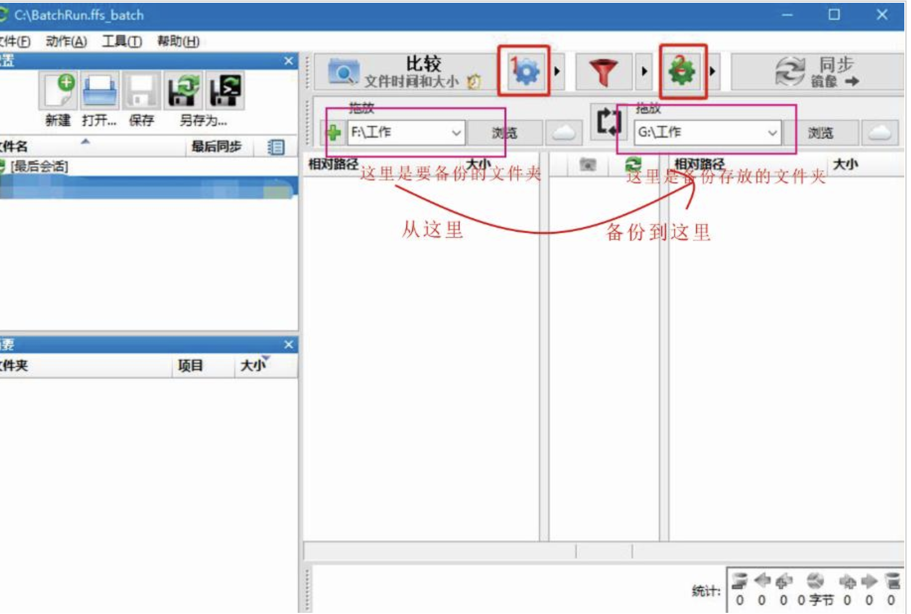
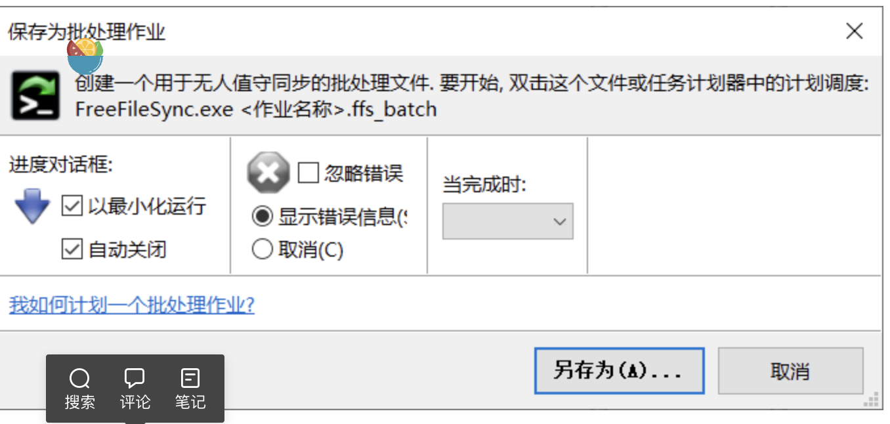
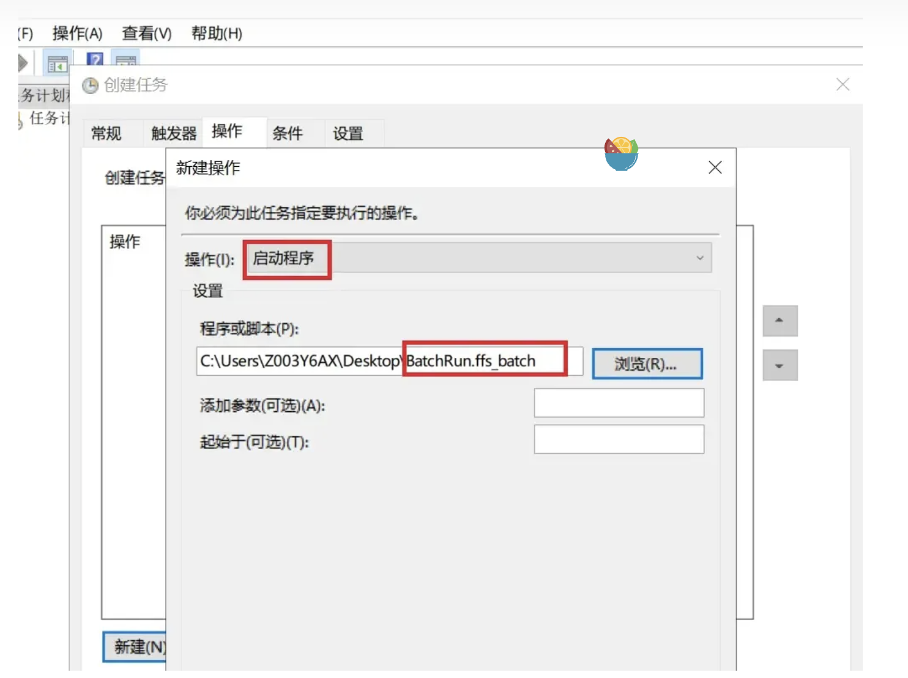
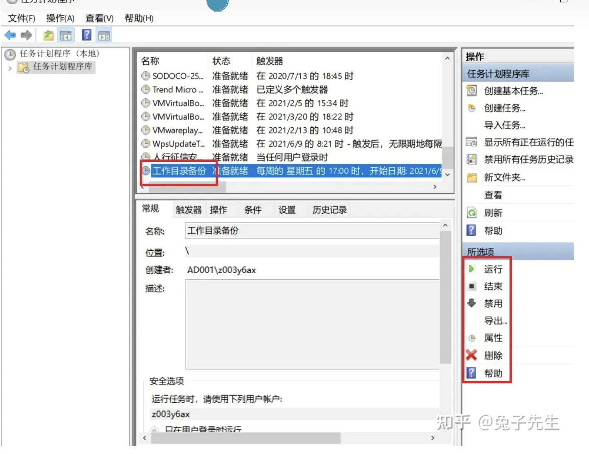

## Linux 同步到 Linux
### rsync
rsync 用于文件同步。
它可以在本地计算机与远程计算机之间，或者两个本地目录之间同步文件（但不支持两台远程计算机之间的同步）。它也可以当作文件复制工具，替代cp和mv命令。
最大特点是会检查发送方和接收方已有的文件，仅传输有变动的部分（默认规则是文件大小或修改时间有变动）。
rsync默认的行为是增量同步，也就是说，它只会同步那些有变化的文件，而不是进行全量同步。这是rsync非常强大且高效的一个特性，特别是在处理大量数据时。
> rsync 默认使用两种端口：
> 1. **873端口**：这是rsync守护进程（rsyncd）的默认端口。当你启动rsync守护进程时，它将监听这个端口以接受来自客户端的连接和同步请求。
> 2. **8087端口**：这是rsync的默认Web管理界面端口。如果你启用了rsync的Web管理功能，它将在这个端口上提供HTTP服务，允许用户通过Web浏览器访问和管理同步任务。

```
# Debian
$ sudo apt-get install rsync

# Red Hat
$ sudo yum install rsync

# Arch Linux
$ sudo pacman -S rsync
```
注意，传输的双方都必须安装 rsync。

#### 参数
-r表示递归，即包含子目录
-a参数可以替代-r，除了可以递归同步以外，还可以同步元信息（比如修改时间、权限等），目标目录destination如果不存在，rsync 会自动创建。
```
## 源目录source被完整地复制到了目标目录destination下面，
## 即形成了destination/source的目录结构
$ rsync -a source destination


## 只想同步源目录source里面的内容到目标目录destination
$ rsync -a source/ destination
```
-n或--dry-run参数模拟执行的结果，并不真的执行命令。
-v参数则是将结果输出到终端，这样就可以看到哪些内容会被同步。
-z 用于压缩传输数据
```
使用-z选项时，rsync会使用gzip程序对数据进行压缩，然后在接收端解压缩。这意味着即使在本地机器上文件没有被压缩，通过网络传输的数据也会被压缩，从而提高传输效率。
```
--delete参数将删除只存在于目标目录、不存在于源目录的文件。使得目标目录成为源目录的镜像副本
```
$ rsync -av --delete source/ destination
```
可以用--exclude参数指定排除模式，排除某些文件或目录，多个排除模式，可以用多个--exclude参数
```
# 下面命令排除了所有 TXT 文件
$ rsync -av --exclude='*.txt' source/ destination
# 或者
$ rsync -av --exclude '*.txt' source/ destination
# 多个
$ rsync -av --exclude 'file1.txt' --exclude 'dir1/*' source/ destination

```
--include参数用来指定必须同步的文件模式，往往与--exclude结合使用。
```
# 下面命令指定同步时，排除所有文件，但是会包括 TXT 文件。
$ rsync -av --include="*.txt" --exclude='*' source/ destination
```

参考[https://www.ruanyifeng.com/blog/2020/08/rsync.html](https://www.ruanyifeng.com/blog/2020/08/rsync.html)

**使用rsync守护进程和不使用有什么区别**
> rsync可以在两种模式下运行：作为守护进程（rsyncd）或作为普通命令行工具。以下是使用守护进程和不使用守护进程的主要区别：
> ### 作为守护进程（rsyncd）运行：
> 1. **后台运行**：rsync作为守护进程在后台运行，可以持续监听端口，等待客户端的连接请求。
> 2. **多个连接**：守护进程可以同时处理多个客户端连接，这对于多用户环境或需要同时同步多个数据流的情况非常有用。
> 3. **配置文件**：守护进程的配置存储在一个单独的配置文件（通常是/etc/rsyncd.conf）中，允许管理员集中管理同步模块、权限、日志和其他设置。
> 4. **安全性**：通过守护进程模式，可以更好地控制访问权限，例如使用基于模块的认证和加密传输（如SSH）。
> 5. **资源管理**：守护进程模式允许系统更好地管理资源，因为它可以保持常驻内存，而不需要频繁地启动和关闭。
> ### 作为普通命令行工具运行：
> 1. **一次性任务**：当rsync作为命令行工具运行时，它通常执行一次性的同步任务，任务完成后进程就会退出。
> 2. **前台运行**：rsync命令行操作在前台运行，直到同步任务完成。
> 3. **简单性**：对于简单的同步需求或一次性任务，命令行模式更简单直接，无需额外的配置。
> 4. **脚本集成**：rsync命令行操作易于集成到shell脚本中，适合自动化任务和批处理操作。
> 5. **端口使用**：在命令行模式下，rsync不会监听任何端口，它只是在执行时创建一个临时的连接。
> 
总的来说，如果你需要一个持续运行的服务，可以同时处理多个连接，并且需要集中管理同步任务，那么使用rsync守护进程是更好的选择。如果你只是偶尔需要同步文件，或者在脚本中调用rsync，那么直接使用命令行工具可能更简单方便。


### inotify
它使用Linux内核的inotify功能来监控文件系统事件。
inotify允许应用程序接收关于文件系统变化的通知，例如文件的创建、修改、删除等。inotifywait可以递归地监控指定目录中的事件，并在事件发生时执行指定的命令。
```
sudo apt-get install inotify-tools
```

#### 基本语法
```
inotifywait -m -r -q [选项] 目录或文件
```

- -m：监控模式，inotifywait将持续运行，直到手动停止。
- -r：递归模式，递归地监控指定目录及其所有子目录中的事件。
- -q：静默模式，只输出事件信息，不显示其他任何输出。

你可以使用-e选项来指定要监控的事件类型。例如，如果你想监控文件的创建和删除事件，可以使用：
```
inotifywait -m -r -q -e create -e delete /path/to/directory
```


```
#!/bin/bash
inotifywait -m -r -q -e event_name /path/to/local/folder |
while read -r event file; do
    rsync -avz /path/to/local/folder user@remote_host:/path/to/remote/folder
done
```


### linux同步
**前提：先在两台linux电脑上配置免密登录**
**两台电脑都安装了rsync**

同步本地/mnt/windows_share文件夹夹到10.10.95.23机器的/root/collection目录，日志保存在/var/log/synchronization.log
```
#!/bin/bash
inotifywait -m -r -q -e create -e modify /mnt/windows_share |
while read -r event file; do
    rsync -avz /mnt/windows_share root@10.10.95.23:/root/collection >> /var/log/synchronization.log 2>&1
done
```
或者
```
#!/bin/bash

# 同步源目录和目标目录
SOURCE_DIR="/mnt/windows_share"
REMOTE_USER="root"
REMOTE_HOST="10.10.95.23"
REMOTE_DIR="/root/collection"

# 日志文件路径
LOG_FILE="/var/log/synchronization.log"

# 同步函数
sync_files() {
    echo "开始同步..."
    rsync -avz "$SOURCE_DIR" "$REMOTE_USER"@"$REMOTE_HOST":"$REMOTE_DIR" >> "$LOG_FILE" 2>&1
    echo "同步完成。"
    echo "下一次同步将在1分钟后进行。"
}

# 主循环
while true; do
    sync_files
    # 休眠60秒
    sleep 120
done

```
```
chmod +x synchronization.sh
```

启动systemd服务，确保开机自启
```
[Unit]
Description=Rsync Synchronization Service
After=network.target

[Service]
Type=simple
ExecStart=/root/gxc/synchronization.sh
StandardOutput=journal
StandardError=journal

[Install]
WantedBy=multi-user.target
```
```
root@demo-desktop:~/sync# sudo systemctl daemon-reload
root@demo-desktop:~/sync# systemctl start rsync-service
root@demo-desktop:~/sync# systemctl status rsync-service
root@demo-desktop:~/sync# journalctl -u rsync-service.service
root@demo-desktop:~/sync# cat /var/log/synchronization.log
```

## Windows 同步到 Linux
### 1、下载和安装FreeFileSync
FreeFileSync 作为一款由国外开源社区开发的免费备份软件，由于其支持跨平台（Windows、Linux、Mac OS 三大操作系统均可使用）
下载地址：https://freefilesync.org/download.php
[https://freefilesync.cn.uptodown.com/windows/versions](https://freefilesync.cn.uptodown.com/windows/versions)
安装好后显示为两个工具（小绿小红）

### 2、使用


比较设置，默认选择比较文件时间和大小，速度极快，比较文件内容较慢
同步设置，建议选择更新
**设置好后点击 另存为批处理作业 保存文件（记住保存的位置等下红色软件会用到文件）**


最好勾选 “以最小化运行” 和“自动关闭”两项，这样所有操作都是在后台运行，不会打扰我们的工作，否则成功后会有弹窗提示


### 3、定时任务
设置方法如下： 1.在控制面板-系统和安全-管理工具中找到**计划任务** 2.创建新的计划任务，输入名称。

3.在操作中选中要**启动的程序**。切换到**触发器**，在设置里面选择触发频次和时间。


4.创建完成后回到计划任务管理器就看到刚才创建的_文件同步_任务，在右侧任务栏可以选择运行或者禁用。


### Sftp和ftp

1. **FTP**：如果您选择通过FTP进行同步，那么使用的是FTP协议，默认端口是21。
2. **SFTP**：如果您选择通过SFTP进行同步，那么使用的是SFTP协议，默认端口是22。
3. **WebDAV**：如果您选择通过WebDAV进行同步，那么使用的是HTTP或HTTPS协议，默认端口分别是80和443。

#### ftp和sftp的区别
> FTP（File Transfer Protocol）和SFTP（Secure File Transfer Protocol）都是用于在网络上进行文件传输的协议，但它们在安全性和操作方式上有一些关键的区别：
> 
> 1.  **安全性**： 
>    - **FTP**：FTP传输是不加密的，这意味着数据（包括用户名和密码）在传输过程中可能会被截获。因此，FTP不适合传输敏感信息。
>    - **SFTP**：SFTP在SSH（Secure Shell）协议的基础上运行，提供了端到端的加密，包括命令、数据和文件名。这使得SFTP在传输过程中更加安全。
> 2.  **端口**： 
>    - **FTP**：默认情况下，FTP使用端口21进行命令传输，而数据传输通常使用端口20。
>    - **SFTP**：SFTP使用SSH协议的端口22，所有的FTP命令和数据都通过这个端口加密传输。
> 3.  **认证方式**： 
>    - **FTP**：FTP通常使用明文密码进行认证，这在现代网络安全标准中被认为是不安全的。
>    - **SFTP**：SFTP支持多种认证方式，包括密码、公钥/私钥对以及基于会话的密钥交换。
> 4.  **功能**： 
>    - **FTP**：FTP是一个相对较老的协议，它的功能主要集中在文件传输上。
>    - **SFTP**：SFTP除了文件传输外，还提供了文件系统操作的完整访问权限，如列出目录内容、重命名文件、删除文件等。
> 5.  **性能**： 
>    - **FTP**：FTP可以更有效地处理大量数据的传输，因为它不涉及加密过程。
>    - **SFTP**：由于加密过程，SFTP在处理大量数据时可能会比FTP慢一些，但这种差异通常不明显。
> 6.  **兼容性**： 
>    - **FTP**：几乎所有的操作系统和设备都支持FTP。
>    - **SFTP**：SFTP通常需要SSH服务器端的支持，虽然大多数现代操作系统都内置了SSH，但在某些环境中可能需要额外的配置。
> 
> 总的来说，如果您需要安全地传输文件，特别是在公共网络上，SFTP是更好的选择。然而，如果您在一个受信任的网络环境中，且对安全性的要求不是特别高，FTP可能是一个更快和更简单的选项。


#### sftp可以使用非22端口吗
是的，您可以修改服务器上的SSH服务默认端口，从22端口更改为其他端口，比如28，以减少自动化的漏洞扫描和潜在的攻击风险。这种更改称为“端口敲门”（Port Knocking），是一种提高服务器安全性的常见做法。
要更改SSH服务的端口，您需要执行以下步骤：

1.  **编辑SSH配置文件**：
打开服务器上的SSH配置文件`/etc/ssh/sshd_config`（大多数Linux发行版使用这个路径）。您可以使用文本编辑器，如`nano`或`vi`，来编辑此文件。 
```bash
sudo nano /etc/ssh/sshd_config
```

在配置文件中找到`#Port 22`这一行。移除行前的`#`（如果有的话）并将`22`更改为您选择的新端口号，例如`28`。 
```
Port 28
```

如果您添加了新的端口号，确保保存更改。 

2.  **重启SSH服务**：
更改配置后，您需要重启SSH服务以使更改生效。 
```bash
sudo systemctl restart sshd
```

或者在某些系统上，您可能需要使用以下命令： 
```bash
sudo service ssh restart
```
 

3.  **更新防火墙规则**：
确保您的服务器防火墙允许通过新的端口号。您可能需要更新防火墙规则以允许流量到达端口28。 
```bash
sudo ufw allow 28/tcp
```

或者，如果您使用的是`iptables`，您需要添加一条规则来允许端口28的流量。 

4.  **映射到外网**：
如果您的服务器位于NAT后面或使用云服务，您需要在路由器或云服务控制面板上将外部端口30028映射到服务器的内部端口28。 

完成这些步骤后，您需要在FreeFileSync或其他任何SSH客户端中指定新的端口号来进行连接。例如，在FreeFileSync中，您将需要在设置SFTP连接时输入端口号30028，而不是默认的22。
请注意，更改SSH端口可能会影响现有的自动化脚本和工具，确保更新所有相关的配置和通知可能需要访问服务器的用户。此外，虽然更改默认端口可以提高安全性，但它并不是一个全面的安全解决方案。您还应该考虑使用密钥认证、限制登录尝试、保持软件更新和其他安全最佳实践。


### 参考
[https://zhuanlan.zhihu.com/p/672866600](https://zhuanlan.zhihu.com/p/672866600)
[http://www.360doc.com/content/23/0221/13/70588162_1068758929.shtml](http://www.360doc.com/content/23/0221/13/70588162_1068758929.shtml)
[https://blog.csdn.net/adminkeys/article/details/124331228](https://blog.csdn.net/adminkeys/article/details/124331228)
[https://www.jb51.net/softjc/875966.html](https://www.jb51.net/softjc/875966.html)

